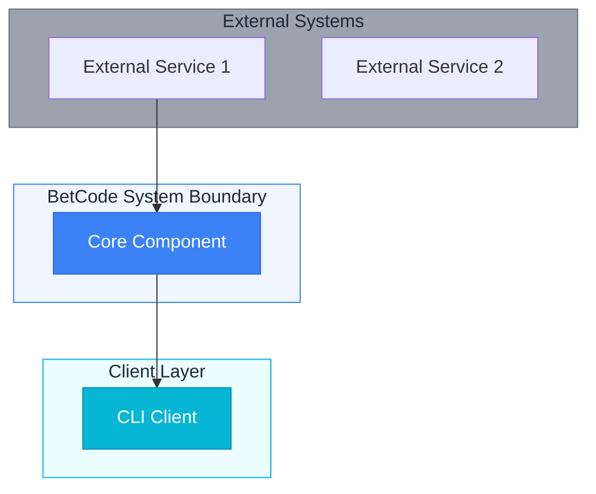
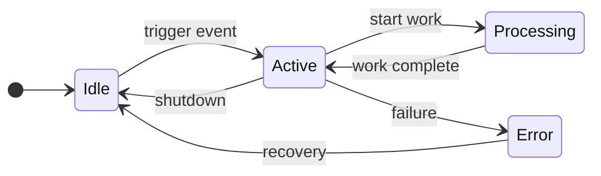
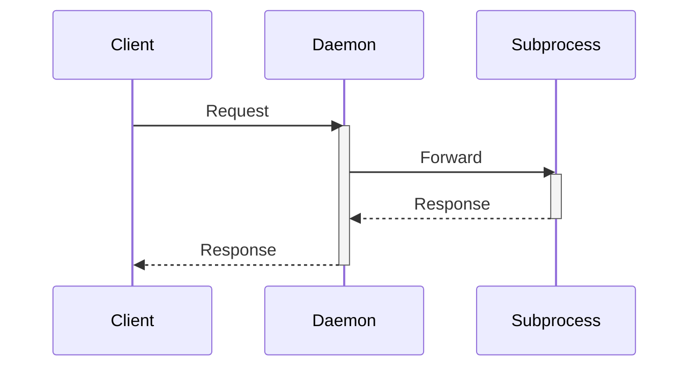
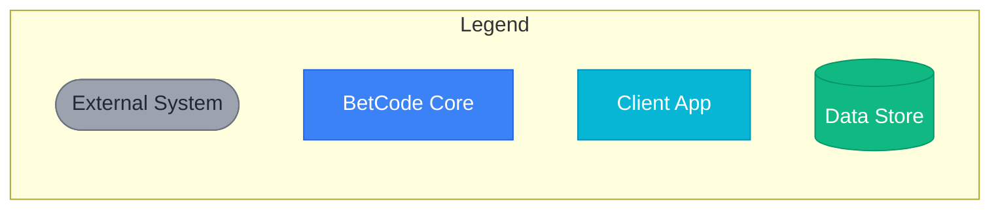

# BetCode Diagram Standards Guide

**Version**: 0.2.0
**Last Updated**: 2026-02-03
**Status**: Active

This guide establishes visual consistency across all BetCode architecture diagrams using Mermaid notation for GitHub-native rendering.

---

## Why Mermaid

1. **GitHub Native**: Renders directly in markdown without external tooling
2. **Version Controlled**: Diagram source lives with documentation
3. **Consistent Styling**: Defined once, applied everywhere
4. **Accessible**: Text-based source works with screen readers
5. **Maintainable**: Easier to update than image files

---

## Color Coding Standards

All BetCode diagrams follow this color scheme for instant visual recognition.

| Element Type | Color | Hex | Use Case |
|--------------|-------|-----|----------|
| **External Systems** | Gray | `#9CA3AF` | Third-party APIs, services outside BetCode |
| **BetCode Core** | Blue | `#3B82F6` | Daemon, relay, core services |
| **Client Applications** | Cyan | `#06B6D4` | CLI, Flutter app, web client |
| **Data Stores** | Green | `#10B981` | SQLite, caches, queues |
| **Data Flow** | Amber | `#F59E0B` | Messages, events, streams |
| **Security Boundary** | Red | `#EF4444` | Auth, permissions, trust boundaries |

### Mermaid Style Definitions

Include this at the top of complex diagrams:

```
%%{init: {'theme': 'base', 'themeVariables': {
  'primaryColor': '#3B82F6',
  'primaryTextColor': '#fff',
  'primaryBorderColor': '#2563EB',
  'secondaryColor': '#10B981',
  'tertiaryColor': '#9CA3AF',
  'lineColor': '#6B7280',
  'textColor': '#1F2937'
}}}%%
```

---

## Diagram Type Selection

| Diagram Purpose | Mermaid Type | When to Use |
|-----------------|--------------|-------------|
| System overview, components | `flowchart` | C4 context/container views |
| Process states, lifecycles | `stateDiagram-v2` | Daemon states, session states |
| Request/response flows | `sequenceDiagram` | Protocol interactions, auth flows |
| Temporal workflows | `sequenceDiagram` | Multi-step operations |
| Data relationships | `erDiagram` | Database schemas |
| Task dependencies | `flowchart` | DAG scheduling, build order |

---

## Naming Conventions

### Node IDs

Use lowercase with underscores. Include component prefix for clarity.

```
Good:  daemon_subprocess, relay_router, client_tui
Bad:   DaemonSubprocess, relay-router, tui
```

### Labels

Use Title Case for component names, sentence case for descriptions.

```
Good:  [Claude Code Subprocess]
Good:  [Manages session state]
Bad:   [claude code subprocess]
Bad:   [MANAGES SESSION STATE]
```

### Edge Labels

Keep edge labels short (3-5 words max). Use lowercase.

```
Good:  -->|gRPC stream|
Good:  -->|NDJSON|
Bad:   -->|Bidirectional gRPC streaming connection|
```

---

## Standard Diagram Templates

### Template 1: System Context (C4 Level 1)



### Template 2: State Diagram



### Template 3: Sequence Diagram



---

## Component Shape Standards

| Component Type | Shape | Example |
|----------------|-------|---------|
| Process/Service | Rectangle | `[Daemon]` |
| Data Store | Cylinder | `[(SQLite)]` |
| External System | Rounded | `([External API])` |
| Decision Point | Diamond | `{Condition?}` |
| Queue/Buffer | Parallelogram | `[/Message Queue/]` |

---

## Arrow Standards

| Connection Type | Arrow | Usage |
|-----------------|-------|-------|
| Synchronous call | `-->` | RPC, function call |
| Async message | `-.->` | Events, notifications |
| Data flow | `==>` | Streams, bulk data |
| Bidirectional | `<-->` | gRPC bidi stream |
| Optional/conditional | `-.->` | May not occur |

---

## Accessibility Requirements

1. **Alt Text**: Every diagram must have a text description above or below
2. **Color Independence**: Information must not rely solely on color
3. **Logical Order**: Nodes should read left-to-right, top-to-bottom
4. **Labels**: All connections must have labels explaining the relationship

---

## File Organization

Diagrams are embedded inline in their respective documentation files. Do not create separate diagram files unless the diagram is reused across multiple documents.

```
docs/architecture/
  OVERVIEW.md          # Contains C4 context diagram
  DAEMON.md            # Contains process lifecycle diagram
  TOPOLOGY.md          # Contains topology diagram
  DIAGRAM_GUIDE.md     # This file (standards reference)
```

---

## Legend Template

Include this legend in documents with multiple diagrams:



---

## Migration Checklist

When converting ASCII diagrams to Mermaid:

- [ ] Identify diagram type (flowchart, sequence, state)
- [ ] Map components to standard color scheme
- [ ] Apply consistent naming conventions
- [ ] Add edge labels for all connections
- [ ] Include legend if diagram uses multiple element types
- [ ] Add text description for accessibility
- [ ] Test rendering in GitHub markdown preview
- [ ] Remove old ASCII version after verification

---

## Related Documents

| Document | Diagrams Contained |
|----------|-------------------|
| [OVERVIEW.md](./OVERVIEW.md) | C4 Context, C4 Container |
| [DAEMON.md](./DAEMON.md) | Process Lifecycle, Multiplexer Flow, Permission Bridge |
| [TOPOLOGY.md](./TOPOLOGY.md) | High-Level Topology, Connection Modes, Daemon Lifecycle |
| [CLIENTS.md](./CLIENTS.md) | TUI Layout, Sync Engine Flow, gRPC Streaming |
| [SUBAGENTS.md](./SUBAGENTS.md) | Orchestration Architecture, DAG Scheduler |
