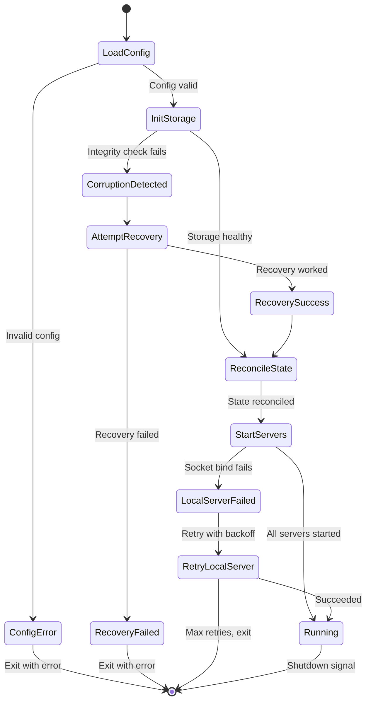
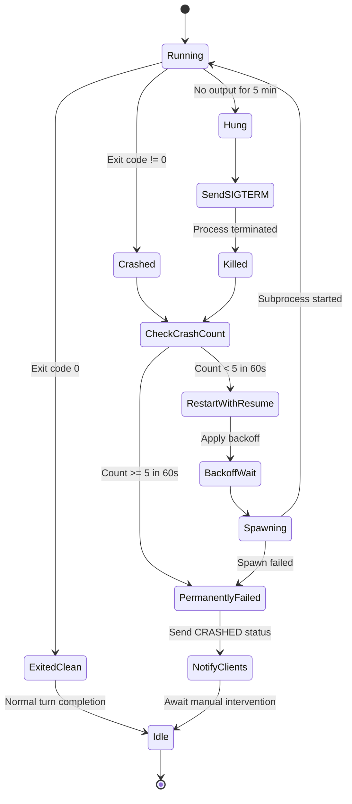
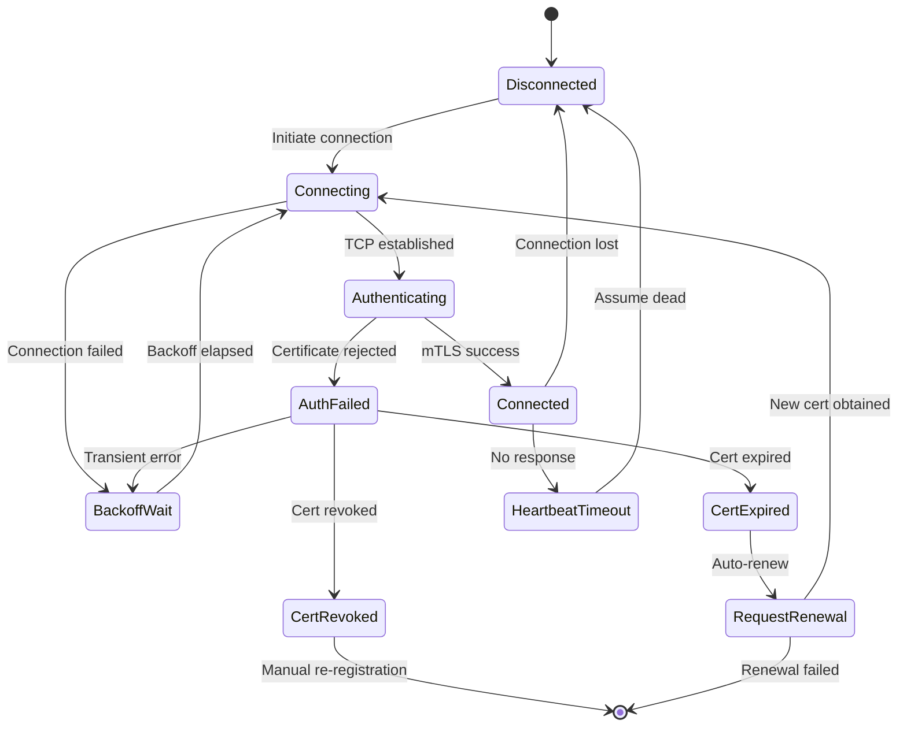
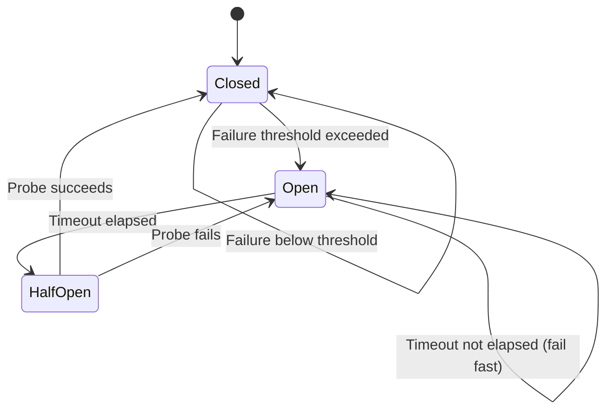
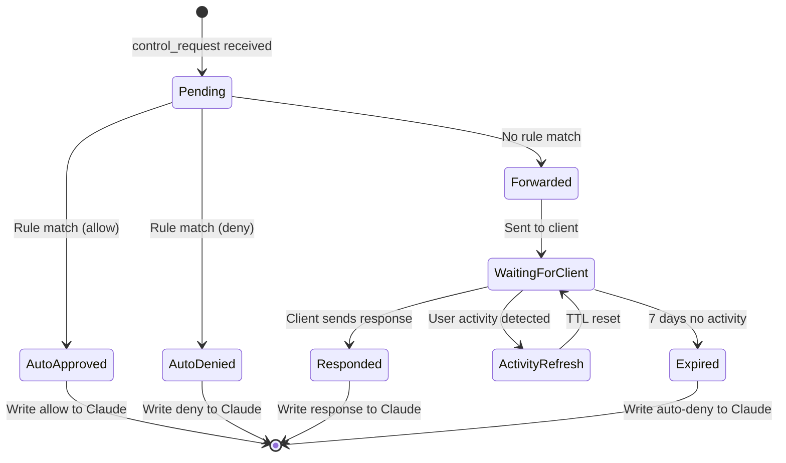

# Recovery State Machines

**Version**: 0.2.0
**Last Updated**: 2026-02-03
**Parent**: [FAILURE_MODES.md](./FAILURE_MODES.md)

---

## Daemon Startup Recovery

---

## Subprocess Crash Recovery

---

## Tunnel Reconnection Recovery

Backoff schedule: 1s, 2s, 4s, 8s, 16s, 32s, 60s (max) with 20% jitter.

---

## Circuit Breaker State Machine

---

## Permission Request Lifecycle

