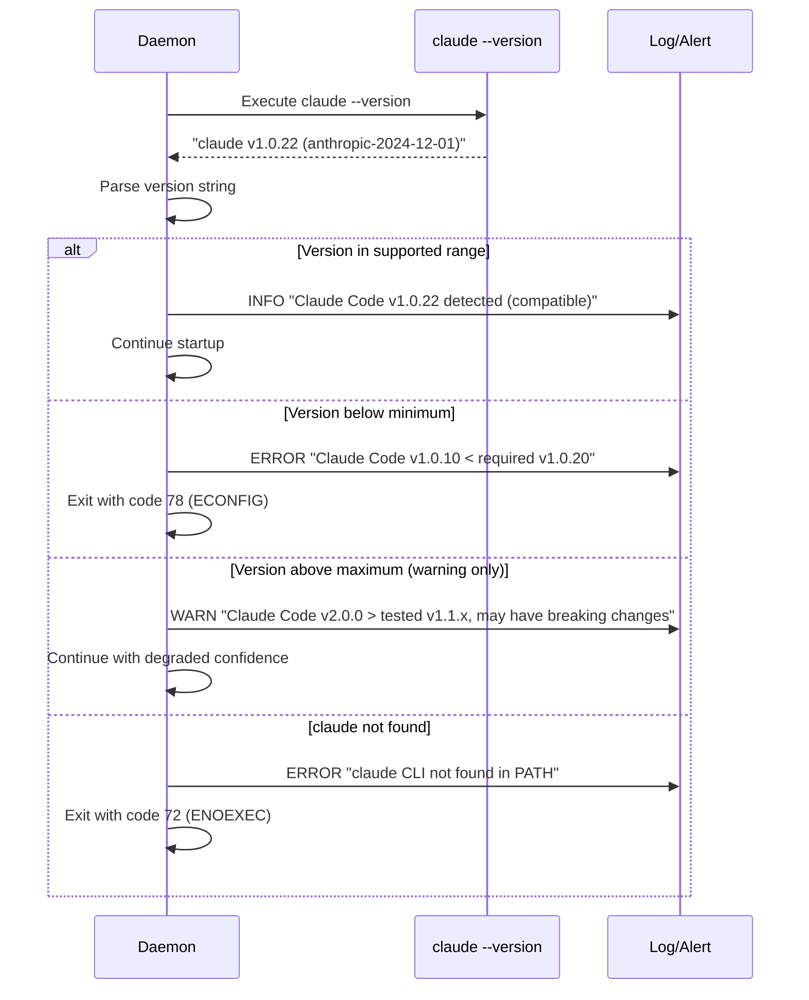

# Layer 1: Claude Code SDK Control Protocol

**Version**: 0.2.0
**Last Updated**: 2026-02-01
**Parent**: [PROTOCOL.md](./PROTOCOL.md)

## Overview

The daemon spawns Claude Code as a subprocess and communicates over stdin/stdout
using newline-delimited JSON (NDJSON). Each line is a complete JSON object.
This is Claude Code's official SDK protocol for programmatic integration.

### Invocation

```bash
claude -p "$prompt" \
  --output-format stream-json \
  --input-format stream-json \
  --permission-prompt-tool stdio \
  --include-partial-messages
```

| Flag | Purpose |
|------|---------|
| `-p "$prompt"` | Initial prompt (headless mode) |
| `--output-format stream-json` | NDJSON output on stdout |
| `--input-format stream-json` | NDJSON input on stdin |
| `--permission-prompt-tool stdio` | Route permission prompts to stdin/stdout |
| `--include-partial-messages` | Emit `stream_event` deltas for real-time streaming |

---

## Payload Size Limits

Individual NDJSON lines (messages from Claude's stdout) are subject to size limits:

| Limit | Value | Enforcement |
|-------|-------|-------------|
| Max payload size | 10 MB | Daemon application layer |
| SQLite TEXT limit | 1 GB | Database layer (not enforced) |

Messages exceeding 10 MB are truncated to 10 MB with a `[truncated: original_size=X bytes]`
marker appended. This affects tool results containing large file contents or command
output. The daemon logs a warning when truncation occurs.

The 10 MB limit is configurable via `daemon.max_payload_bytes` in settings.json.
Default: 10485760 (10 MB).

---

## Claude -> Daemon (stdout)

Every line on stdout is a JSON object with a `type` field. The daemon reads
stdout line by line, parses each object, and dispatches on `type`.

### 1. `system` (init)

Emitted once at session start. Contains session ID, tools, model, and cwd.

```json
{
  "type": "system",
  "subtype": "init",
  "session_id": "abc123-def456-...",
  "tools": [
    { "name": "Bash", "description": "Execute a bash command",
      "input_schema": { "type": "object", "properties": { "command": { "type": "string" } } } }
  ],
  "model": "claude-sonnet-4-20250514",
  "cwd": "/home/user/project"
}
```

**Daemon action**: Store `session_id`, register tool schemas, confirm model.

### 2. `assistant`

Complete assistant message with full `content` array (text + tool_use blocks).

```json
{
  "type": "assistant",
  "message": {
    "role": "assistant",
    "content": [
      { "type": "text", "text": "I'll read the file for you." },
      { "type": "tool_use", "id": "toolu_01ABC", "name": "Read",
        "input": { "file_path": "/home/user/project/src/main.rs" } }
    ],
    "stop_reason": "tool_use",
    "usage": { "input_tokens": 1250, "output_tokens": 87 }
  }
}
```

**`stop_reason` values**: `"end_turn"` (done), `"tool_use"` (tools pending),
`"max_tokens"` (truncated).

**Daemon action**: Parse content blocks. Stream text to client. Enter
permission/execution flow for tool_use blocks.

### 3. `user`

Tool results echoed back, confirming incorporation into conversation.

```json
{
  "type": "user",
  "message": {
    "role": "user",
    "content": [
      { "type": "tool_result", "tool_use_id": "toolu_01ABC",
        "content": "     1\tuse std::io;\n     2\tfn main() {\n     3\t    // entry\n     4\t}\n" }
    ]
  }
}
```

**Daemon action**: Log for debugging. No client-facing event needed.

### 4. `stream_event`

Partial streaming deltas (requires `--include-partial-messages`).

```json
{
  "type": "stream_event",
  "event": {
    "type": "content_block_delta",
    "index": 0,
    "delta": { "type": "text_delta", "text": "I'll read" }
  }
}
```

**Event subtypes:**
- `content_block_start` -- beginning of text or tool_use block
- `content_block_delta` -- incremental content (`text_delta` or `input_json_delta`)
- `content_block_stop` -- end of a content block
- `message_start` / `message_delta` / `message_stop` -- message-level boundaries

**Daemon action**: Translate `text_delta` into gRPC `TextDelta`. Buffer
`input_json_delta` to reconstruct tool inputs.

### 5. `control_request`

Permission check or user input needed. Each has a unique `request_id`.

**Permission request:**
```json
{
  "type": "control_request",
  "request_id": "req_001",
  "request": {
    "subtype": "can_use_tool",
    "tool_name": "Bash",
    "input": { "command": "cargo build --release" }
  }
}
```

**AskUserQuestion request:**
```json
{
  "type": "control_request",
  "request_id": "req_002",
  "request": {
    "subtype": "can_use_tool",
    "tool_name": "AskUserQuestion",
    "input": {
      "questions": [
        { "question": "Which database?", "options": ["PostgreSQL", "SQLite"], "multi_select": false }
      ]
    }
  }
}
```

**Multiplexing**: Multiple `control_request` messages can be in flight
simultaneously. Matched by `request_id`.

**Daemon action**: Evaluate permission engine. Auto-resolve if rule matches.
Forward to client if no rule or if AskUserQuestion. Track pending requests.

### 6. `result`

Session end. Contains duration, cost, and usage summary.

```json
{
  "type": "result",
  "subtype": "success",
  "session_id": "abc123-def456-...",
  "duration_ms": 45200,
  "total_cost_usd": 0.0847,
  "usage": { "input_tokens": 15400, "output_tokens": 3200,
    "cache_creation_input_tokens": 0, "cache_read_input_tokens": 12000 }
}
```

Error variant: `"subtype": "error"` with `"error": "Rate limit exceeded"`.

**Daemon action**: Persist summary to SQLite. Emit `UsageReport` +
`StatusChange(IDLE)` to clients.

---

## Version Compatibility Layer

BetCode depends on Claude Code's `--output-format stream-json` protocol, which is
NOT under BetCode's control. This creates an implicit coupling that can break
silently when Claude Code updates. The following mechanisms provide explicit
version contracts with runtime checking and graceful degradation.

### The Problem: Implicit Protocol Dependency

```
+------------------+     +------------------+     +------------------+
| BetCode Daemon   |     | Claude Code CLI  |     | Anthropic API    |
| (We control)     |---->| (They control)   |---->| (They control)   |
+------------------+     +------------------+     +------------------+
        |                        |
        | NDJSON Protocol        | Updates can happen
        | (Implicit contract)    | via `npm update`
        |                        |
        +------------------------+
        Silent breakage risk: Claude Code's NDJSON format
        can change between versions without warning.
```

### Version Detection Strategy

The daemon MUST detect Claude Code's version at startup and validate compatibility.

#### 1. Version Discovery

```bash
# At daemon startup, before any session
claude --version
# Expected output format: "claude v1.0.22 (anthropic-2024-12-01)"
```

Parse output into structured version info:

```rust
struct ClaudeCodeVersion {
    major: u32,
    minor: u32,
    patch: u32,
    api_version: Option<String>,  // e.g., "anthropic-2024-12-01"
}
```

#### 2. Compatibility Matrix

BetCode maintains an explicit compatibility matrix:

| BetCode Version | Claude Code Min | Claude Code Max | Notes |
|-----------------|-----------------|-----------------|-------|
| 0.1.x           | 1.0.15          | 1.0.*           | Initial release |
| 0.2.x           | 1.0.20          | 1.1.*           | Added `stream_event` support |
| 0.3.x           | 1.1.0           | 2.0.*           | Planned |

This matrix is embedded in the daemon binary and checked at startup:

```rust
const CLAUDE_MIN_VERSION: &str = "1.0.20";
const CLAUDE_MAX_VERSION: &str = "1.1.99"; // Exclusive upper bound
const BETCODE_VERSION: &str = env!("CARGO_PKG_VERSION");
```

#### 3. Startup Version Check Sequence



#### 4. Health Check Integration

The version check result is exposed via the health endpoint:

```protobuf
message HealthDetailsResponse {
  // ... existing fields ...
  ClaudeCodeStatus claude_code = 10;
}

message ClaudeCodeStatus {
  string version = 1;           // e.g., "1.0.22"
  string api_version = 2;       // e.g., "anthropic-2024-12-01"
  CompatibilityLevel level = 3;
  string message = 4;           // Human-readable status
}

enum CompatibilityLevel {
  COMPATIBILITY_UNKNOWN = 0;
  FULLY_COMPATIBLE = 1;         // Within tested range
  LIKELY_COMPATIBLE = 2;        // Above max, no known issues
  DEGRADED = 3;                 // Missing features, workarounds active
  INCOMPATIBLE = 4;             // Below minimum, daemon refuses to start
}
```

### Protocol Adapter Pattern

To handle protocol changes across Claude Code versions, the daemon uses an adapter
pattern that normalizes NDJSON messages to an internal canonical format.

#### Adapter Architecture

```
Claude stdout --> RawNdjsonLine --> ProtocolAdapter --> CanonicalMessage --> Multiplexer
                                           |
                      +--------------------+--------------------+
                      |                    |                    |
               V1Adapter            V1_1Adapter          V2Adapter
              (1.0.x)               (1.1.x)              (future)
```

#### Adapter Interface

```rust
trait ProtocolAdapter: Send + Sync {
    /// Returns the Claude Code version range this adapter handles
    fn supported_range(&self) -> (Version, Version);

    /// Parse a raw NDJSON line into a canonical message
    fn parse(&self, line: &str) -> Result<CanonicalMessage, ParseError>;

    /// Format a canonical message for Claude's stdin
    fn format(&self, msg: &CanonicalCommand) -> Result<String, FormatError>;

    /// Handle unknown message types (forward compatibility)
    fn handle_unknown(&self, msg_type: &str, raw: &Value) -> UnknownHandling;
}

enum UnknownHandling {
    /// Pass through as-is (tolerant reader)
    PassThrough(CanonicalMessage),
    /// Log and skip (non-critical unknown type)
    LogAndSkip { level: LogLevel, reason: String },
    /// Fatal error (critical unknown type)
    Fatal { reason: String },
}
```

#### Canonical Message Types

The daemon's internal representation, decoupled from wire format:

```rust
enum CanonicalMessage {
    SystemInit {
        session_id: String,
        tools: Vec<ToolSchema>,
        model: String,
        cwd: PathBuf,
        // Fields added in later versions are Optional
        api_version: Option<String>,     // Added in 1.1.0
        capabilities: Option<Vec<String>>, // Future
    },
    AssistantMessage {
        content: Vec<ContentBlock>,
        stop_reason: StopReason,
        usage: Usage,
    },
    StreamDelta {
        index: u32,
        delta: DeltaContent,
    },
    ControlRequest {
        request_id: String,
        request: PermissionRequest,
    },
    Result {
        subtype: ResultSubtype,
        session_id: String,
        duration_ms: u64,
        cost_usd: Option<f64>,
        usage: Usage,
    },
    // Forward-compatibility envelope
    Unknown {
        raw_type: String,
        payload: Value,
    },
}
```

#### Version-Specific Adapters

**V1.0.x Adapter** (current baseline):

```rust
impl ProtocolAdapter for V1Adapter {
    fn supported_range(&self) -> (Version, Version) {
        (Version::new(1, 0, 0), Version::new(1, 1, 0))
    }

    fn parse(&self, line: &str) -> Result<CanonicalMessage, ParseError> {
        let raw: Value = serde_json::from_str(line)?;
        let msg_type = raw["type"].as_str().ok_or(ParseError::MissingType)?;

        match msg_type {
            "system" => self.parse_system(&raw),
            "assistant" => self.parse_assistant(&raw),
            "user" => self.parse_user(&raw),
            "stream_event" => self.parse_stream_event(&raw),
            "control_request" => self.parse_control_request(&raw),
            "result" => self.parse_result(&raw),
            unknown => Ok(CanonicalMessage::Unknown {
                raw_type: unknown.to_string(),
                payload: raw,
            }),
        }
    }

    fn handle_unknown(&self, msg_type: &str, _raw: &Value) -> UnknownHandling {
        // V1 adapter: log unknown types at WARN level, continue
        UnknownHandling::LogAndSkip {
            level: LogLevel::Warn,
            reason: format!("Unknown message type '{}' in V1 protocol", msg_type),
        }
    }
}
```

### Tolerant Reader Implementation

Following Postel's Law: "Be conservative in what you send, be liberal in what you accept."

#### Rules for Parsing Claude Code Output

1. **Unknown fields**: MUST be ignored (not an error)
2. **Unknown message types**: MUST be logged and skipped (not fatal)
3. **Missing optional fields**: MUST use sensible defaults
4. **Type coercion**: SHOULD accept reasonable alternatives (e.g., number as string)
5. **Ordering**: MUST NOT assume message order beyond documented guarantees

#### Implementation Example

```rust
fn parse_result(&self, raw: &Value) -> Result<CanonicalMessage, ParseError> {
    // Required fields: fail if missing
    let session_id = raw["session_id"]
        .as_str()
        .ok_or(ParseError::MissingField("session_id"))?
        .to_string();

    // Optional fields: use defaults
    let cost_usd = raw.get("total_cost_usd")
        .and_then(|v| v.as_f64());  // None if missing or wrong type

    let duration_ms = raw.get("duration_ms")
        .and_then(|v| v.as_u64())
        .unwrap_or(0);  // Default to 0 if missing

    // Tolerant type handling: accept both number and string
    let input_tokens = match &raw["usage"]["input_tokens"] {
        Value::Number(n) => n.as_u64().unwrap_or(0) as u32,
        Value::String(s) => s.parse().unwrap_or(0),
        _ => 0,
    };

    // Unknown subtype handling
    let subtype = match raw["subtype"].as_str() {
        Some("success") => ResultSubtype::Success,
        Some("error") => ResultSubtype::Error,
        Some(other) => {
            log::warn!("Unknown result subtype '{}', treating as success", other);
            ResultSubtype::Success
        }
        None => ResultSubtype::Success,
    };

    Ok(CanonicalMessage::Result { /* ... */ })
}
```

### Graceful Degradation Modes

When Claude Code version is above the tested range, the daemon operates with
reduced confidence and enables degradation modes.

#### Degradation Level 1: Unknown Message Types

```rust
// When receiving unknown message types frequently
struct DegradationState {
    unknown_type_count: AtomicU32,
    last_unknown_types: RwLock<HashSet<String>>,
}

impl DegradationState {
    fn record_unknown(&self, msg_type: &str) {
        let count = self.unknown_type_count.fetch_add(1, Ordering::Relaxed);
        if count == 10 {
            log::warn!(
                "Received 10+ unknown message types: {:?}. \
                 Claude Code may have updated. Consider upgrading BetCode.",
                self.last_unknown_types.read()
            );
        }
    }
}
```

#### Degradation Level 2: Parse Failures

```rust
// When parsing known types fails due to schema changes
fn handle_parse_error(&self, msg_type: &str, err: &ParseError, raw: &str) {
    match self.degradation_mode {
        DegradationMode::Strict => {
            // Fail hard in tested version range
            panic!("Parse error for known type '{}': {}", msg_type, err);
        }
        DegradationMode::Tolerant => {
            // Log and skip in untested version range
            log::error!(
                "Failed to parse '{}': {}. Raw: {}. \
                 Running in tolerant mode due to untested Claude Code version.",
                msg_type, err, raw
            );
            self.metrics.increment("parse_errors_tolerated");
        }
    }
}
```

#### Degradation Level 3: Missing Critical Features

```rust
// When expected features are absent
fn check_critical_features(&self, system_init: &CanonicalMessage) -> FeatureStatus {
    let mut missing = Vec::new();

    // Check for expected capabilities
    if !system_init.has_tool("Bash") {
        missing.push("Bash tool");
    }

    if system_init.tools.iter().all(|t| t.input_schema.is_none()) {
        missing.push("Tool input schemas");
    }

    if missing.is_empty() {
        FeatureStatus::AllPresent
    } else {
        log::warn!("Missing expected features: {:?}", missing);
        FeatureStatus::Degraded(missing)
    }
}
```

### Consumer-Driven Contract Testing

BetCode maintains a contract test suite that validates assumptions about Claude Code's protocol.

#### Contract Test Structure

```
crates/betcode-daemon/tests/contracts/
    claude_code_v1_0_x/
        system_init.json        # Expected system init message
        assistant_message.json  # Expected assistant message
        stream_events.json      # Expected streaming sequence
        control_request.json    # Expected permission request
        result_message.json     # Expected result message
    claude_code_v1_1_x/
        # ... new/changed message formats ...
```

#### Contract Test Implementation

```rust
#[test]
fn contract_system_init_v1_0_x() {
    let raw = include_str!("contracts/claude_code_v1_0_x/system_init.json");
    let adapter = V1Adapter::new();

    let result = adapter.parse(raw);

    assert!(result.is_ok(), "Failed to parse v1.0.x system init");
    let msg = result.unwrap();

    // Verify required fields
    assert!(matches!(msg, CanonicalMessage::SystemInit { .. }));
    if let CanonicalMessage::SystemInit { session_id, tools, model, .. } = msg {
        assert!(!session_id.is_empty(), "session_id must be non-empty");
        assert!(!tools.is_empty(), "tools must be non-empty");
        assert!(!model.is_empty(), "model must be non-empty");
    }
}

#[test]
fn contract_tolerant_reader_ignores_unknown_fields() {
    // System init with extra fields (simulating future Claude Code version)
    let raw = r#"{
        "type": "system",
        "subtype": "init",
        "session_id": "test-123",
        "tools": [],
        "model": "claude-sonnet-4-20250514",
        "cwd": "/tmp",
        "unknown_field": "should be ignored",
        "another_unknown": { "nested": true }
    }"#;

    let adapter = V1Adapter::new();
    let result = adapter.parse(raw);

    assert!(result.is_ok(), "Unknown fields must not cause parse failure");
}
```

### Deprecation and Migration Notices

When a new Claude Code version introduces breaking changes, the daemon provides
clear migration guidance.

#### Runtime Deprecation Warnings

```rust
fn check_deprecations(&self, claude_version: &Version) {
    if claude_version >= &Version::new(1, 1, 0) {
        if self.uses_legacy_permission_format() {
            log::warn!(
                "DEPRECATION: Claude Code 1.1.0+ uses new permission format. \
                 BetCode will auto-convert, but update recommended. \
                 See: https://betcode.dev/docs/migration/1.1"
            );
        }
    }
}
```

#### Startup Migration Check

```
$ betcode daemon start
Detected Claude Code v1.1.5 (tested with BetCode up to v1.0.x)

COMPATIBILITY NOTICE:
  - Stream format: Compatible (auto-adapting)
  - Permission protocol: Using legacy compatibility mode
  - New features available: context_window_info, tool_timing

Recommendation: Update BetCode to v0.3.x for full v1.1.x support
Documentation: https://betcode.dev/docs/compatibility

Starting daemon in LIKELY_COMPATIBLE mode...
```

---

## Daemon -> Claude (stdin)

### 1. `control_response`

Reply to a `control_request`. `request_id` must match.

**Allow:**
```json
{
  "type": "control_response",
  "response": {
    "subtype": "success", "request_id": "req_001",
    "response": { "behavior": "allow", "updatedInput": { "command": "cargo build --release" } }
  }
}
```

`updatedInput` is optional. Used to inject sandbox constraints, absolutize
paths, or (for AskUserQuestion) include the user's `answers` map.

**Deny:**
```json
{
  "type": "control_response",
  "response": {
    "subtype": "success", "request_id": "req_001",
    "response": { "behavior": "deny", "message": "User denied permission." }
  }
}
```

**AskUserQuestion response:**
```json
{
  "type": "control_response",
  "response": {
    "subtype": "success", "request_id": "req_002",
    "response": {
      "behavior": "allow",
      "updatedInput": {
        "questions": [{ "question": "Which database?", "options": ["PostgreSQL", "SQLite"] }],
        "answers": { "Which database?": "SQLite" }
      }
    }
  }
}
```

### 2. `user` (new prompt)

Continue a multi-turn conversation on an existing subprocess.

```json
{
  "type": "user",
  "message": { "role": "user", "content": "Now run the tests please." },
  "session_id": "abc123-def456-..."
}
```

Sent after a turn completes while the subprocess remains alive.
