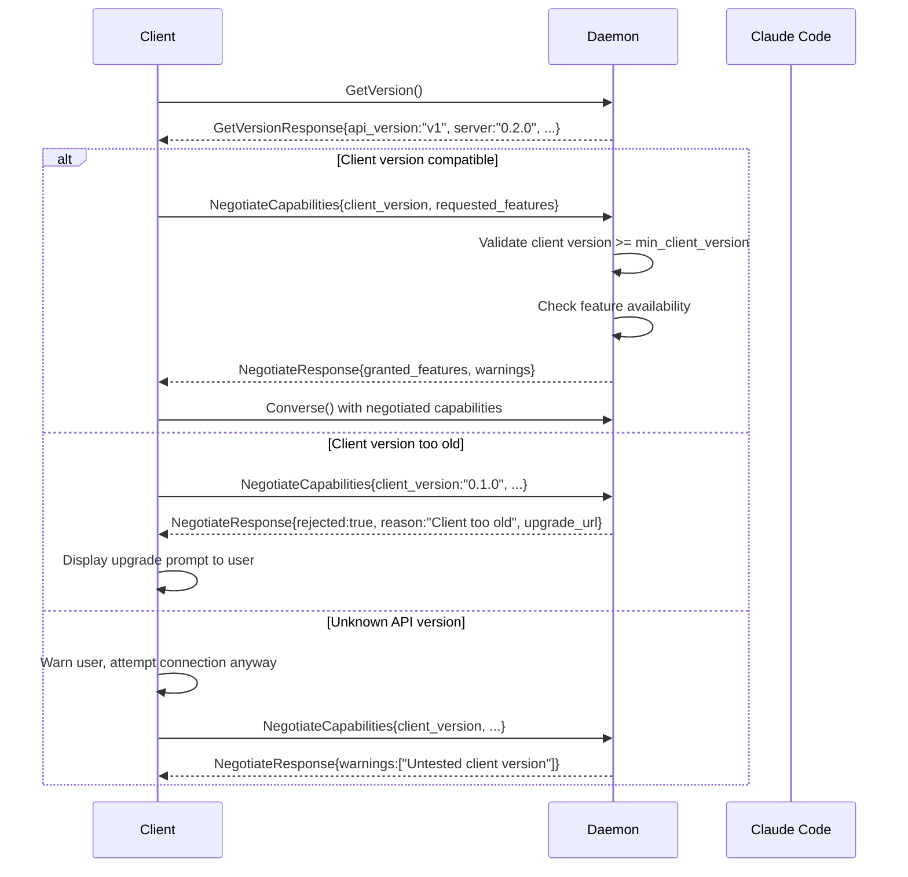
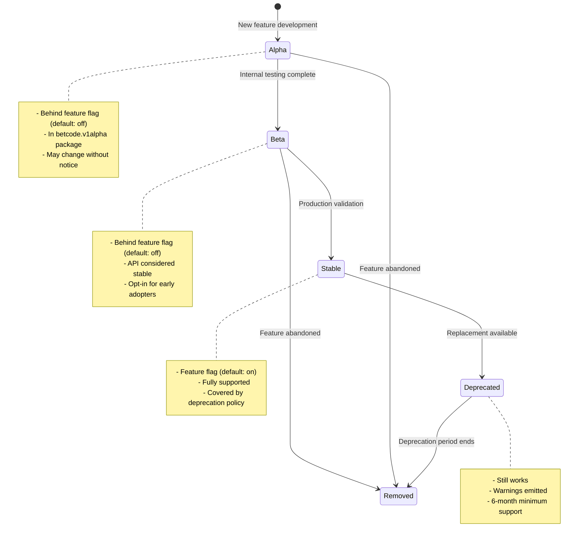
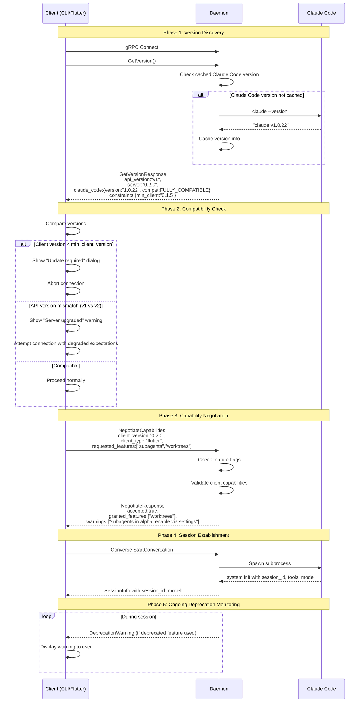
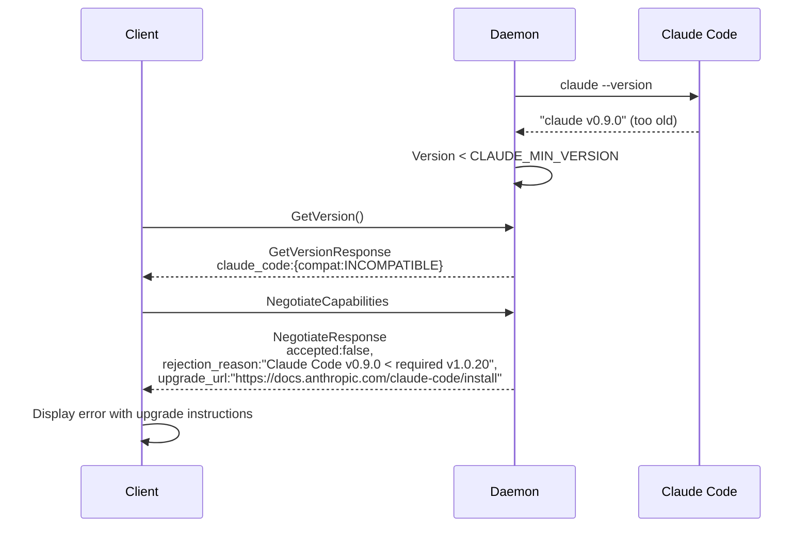
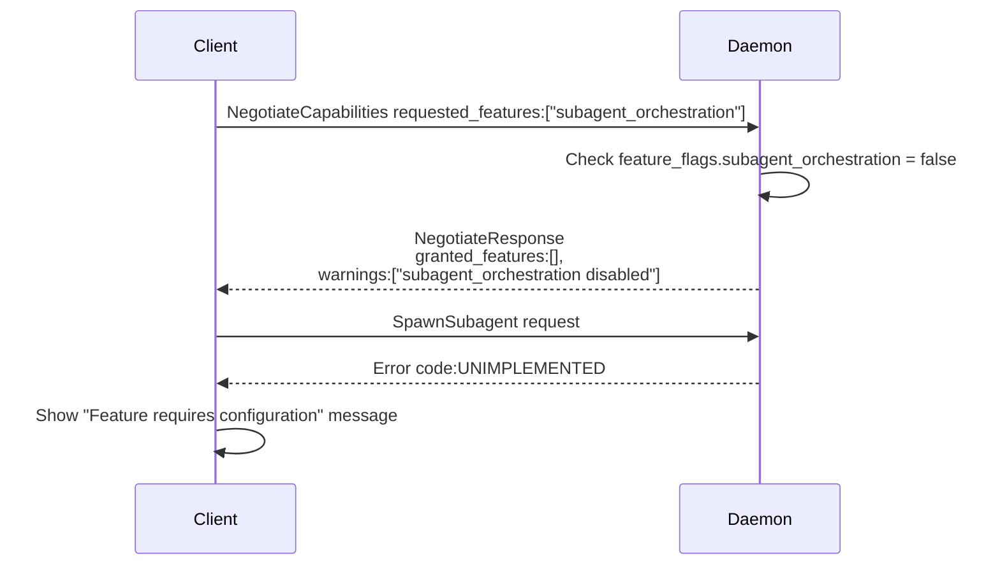

# Layer 2: BetCode gRPC API

**Version**: 0.1.0-alpha.1
**Last Updated**: 2026-02-14
**Parent**: [PROTOCOL.md](./PROTOCOL.md)

## Overview

The gRPC protocol connecting BetCode clients to the daemon (and optionally
through the relay). All proto definitions live in `proto/betcode/v1/`.

---

## Protobuf Versioning Strategy

BetCode uses semantic versioning for protobuf packages with API stability guarantees.

### Package Naming

```
betcode.v1       # Stable API (current)
betcode.v2       # Future breaking changes (not yet created)
betcode.v1alpha  # Experimental features (may change without notice)
```

### Version Rules

| Change Type | Version Impact | Migration |
|-------------|----------------|-----------|
| New message/field (optional) | None | Backward compatible |
| New RPC method | None | Backward compatible |
| New enum value | None | Backward compatible |
| Rename field/message | Major (v1 -> v2) | Deprecation period |
| Remove field/message | Major (v1 -> v2) | Deprecation period |
| Change field type | Major (v1 -> v2) | Deprecation period |
| Change field number | Major (v1 -> v2) | Requires regeneration |

### Deprecation Process

1. **Mark deprecated**: Add `[deprecated = true]` and doc comment explaining replacement.
2. **Minimum support**: Deprecated features supported for 6 months or 2 major releases.
3. **Removal notice**: Announced in release notes 3 months before removal.
4. **Major version**: Removal occurs only in new major version (v1 -> v2).

Example:
```protobuf
message OldRequest {
  option deprecated = true;  // Use NewRequest instead. Removal in v2.
  string old_field = 1;
}
```

### Alpha Features

Features in `betcode.v1alpha` package:
- May change or be removed without deprecation period
- Not recommended for production use
- Clearly documented as experimental
- Promoted to stable (`betcode.v1`) when mature

### Version Detection

Clients MUST check server version compatibility before establishing sessions.

```protobuf
service VersionService {
  rpc GetVersion(GetVersionRequest) returns (GetVersionResponse);
  rpc NegotiateCapabilities(NegotiateRequest) returns (NegotiateResponse);
}

message GetVersionRequest {}

message GetVersionResponse {
  string api_version = 1;           // e.g., "v1"
  string server_version = 2;        // e.g., "0.2.0"
  repeated string features = 3;     // Enabled feature flags
  ClaudeCodeInfo claude_code = 4;   // Underlying Claude Code version
  VersionConstraints constraints = 5;
}

message ClaudeCodeInfo {
  string version = 1;               // e.g., "1.0.22"
  string api_version = 2;           // e.g., "anthropic-2024-12-01"
  CompatibilityLevel compatibility = 3;
}

enum CompatibilityLevel {
  COMPATIBILITY_UNKNOWN = 0;
  FULLY_COMPATIBLE = 1;
  LIKELY_COMPATIBLE = 2;
  DEGRADED = 3;
  INCOMPATIBLE = 4;
}

message VersionConstraints {
  string min_client_version = 1;    // Minimum client version accepted
  string recommended_client = 2;    // Recommended client version
  repeated string deprecated_features = 3;  // Features scheduled for removal
  map<string, string> feature_replacements = 4;  // old_feature -> new_feature
}
```

### Version Negotiation Protocol



### Capability Negotiation

```protobuf
message NegotiateRequest {
  string client_version = 1;          // Client software version
  string client_type = 2;             // "cli", "flutter", "headless"
  repeated string requested_features = 3;  // Features client wants to use
  map<string, string> client_capabilities = 4;  // What client supports
}

message NegotiateResponse {
  bool accepted = 1;
  string rejection_reason = 2;        // If not accepted
  string upgrade_url = 3;             // Where to get newer client
  repeated string granted_features = 4;   // Subset of requested that are available
  repeated string warnings = 5;           // Non-fatal compatibility warnings
  CapabilitySet capabilities = 6;         // Full capability matrix
}

message CapabilitySet {
  bool streaming_supported = 1;
  bool compression_supported = 2;
  uint32 max_message_size = 3;
  repeated string available_tools = 4;
  repeated string available_models = 5;
  bool subagents_enabled = 6;
  bool worktrees_enabled = 7;
  map<string, bool> feature_flags = 8;  // Runtime feature toggles
}
```

Clients compare `api_version` and warn on mismatch.

---

## Feature Flags for Gradual Rollout

BetCode uses feature flags to safely introduce new functionality without
requiring coordinated client/server upgrades.

### Feature Flag Architecture

```
+------------------+     +------------------+     +------------------+
| Client           |     | Daemon           |     | Config           |
|                  |     |                  |     |                  |
| Requests feature |---->| Checks flag      |---->| settings.json    |
| in Negotiate()   |     | availability     |     | feature_flags{}  |
|                  |<----| Returns granted  |     |                  |
+------------------+     +------------------+     +------------------+
```

### Feature Flag Definition

```protobuf
message FeatureFlag {
  string name = 1;                    // e.g., "subagent_orchestration"
  string description = 2;
  FeatureStage stage = 3;
  string introduced_version = 4;      // Server version that added this
  string min_client_version = 5;      // Minimum client to use this
  string deprecated_version = 6;      // When deprecation started (empty if not)
  string removal_version = 7;         // When it will be removed (empty if not)
}

enum FeatureStage {
  FEATURE_STAGE_UNKNOWN = 0;
  ALPHA = 1;           // Experimental, may break
  BETA = 2;            // Stable API, limited testing
  STABLE = 3;          // Production ready
  DEPRECATED = 4;      // Working but scheduled for removal
  REMOVED = 5;         // No longer available
}
```

### Feature Flag Configuration

```json
// settings.json
{
  "feature_flags": {
    "subagent_orchestration": true,
    "streaming_tool_results": false,
    "experimental_compaction": false,
    "legacy_permission_format": true
  }
}
```

### Feature Flag Lifecycle



### Runtime Feature Checking

```rust
// Server-side feature gate
fn handle_subagent_request(&self, req: SubagentRequest) -> Result<Response> {
    if !self.features.is_enabled("subagent_orchestration") {
        return Err(Status::unimplemented(
            "Subagent orchestration not enabled. \
             Enable via settings.json feature_flags.subagent_orchestration"
        ));
    }
    // ... handle request
}

// Client-side feature check (Dart)
Future<void> spawnSubagent(SubagentRequest req) async {
  final caps = await client.negotiateCapabilities(NegotiateRequest(
    requestedFeatures: ['subagent_orchestration'],
  ));

  if (!caps.grantedFeatures.contains('subagent_orchestration')) {
    throw FeatureNotAvailableException(
      'Subagent orchestration requires daemon upgrade to 0.3.0+',
    );
  }
  // ... proceed with request
}
```

### Current Feature Flags

| Flag | Stage | Since | Description |
|------|-------|-------|-------------|
| `streaming_deltas` | Stable | 0.1.0 | Real-time text streaming |
| `permission_bridge` | Stable | 0.1.0 | Permission request forwarding |
| `session_persistence` | Stable | 0.1.0 | SQLite message storage |
| `worktree_management` | Beta | 0.2.0 | Git worktree operations |
| `subagent_orchestration` | Alpha | 0.2.0 | Multi-agent DAG execution |
| `context_compaction` | Alpha | 0.2.0 | Session context compression |
| `legacy_permission_format` | Deprecated | 0.1.0 | Old permission wire format |

---

## Unknown Field Handling

Protobuf's wire format inherently supports forward compatibility through unknown
field preservation. BetCode enforces additional guarantees.

### Unknown Field Policy

| Component | Unknown Fields | Rationale |
|-----------|----------------|-----------|
| Daemon (server) | Preserve and log | Newer clients may send future fields |
| CLI (client) | Ignore silently | Older clients don't need new fields |
| Flutter (client) | Ignore silently | Same as CLI |
| Relay (router) | Pass through | Must not alter messages |

### Implementation

```rust
// Daemon: preserve unknown fields for debugging
fn handle_agent_request(&self, req: AgentRequest) -> Result<Response> {
    // Log unknown fields at DEBUG level for troubleshooting
    if !req.unknown_fields().is_empty() {
        log::debug!(
            "AgentRequest contains unknown fields: {:?}",
            req.unknown_fields()
        );
        self.metrics.increment("unknown_fields_received");
    }
    // Process normally - unknown fields don't affect behavior
    // ...
}
```

```dart
// Flutter: ignore unknown fields (default protobuf behavior)
// No special handling needed - protobuf-dart ignores unknowns
```

### Adding New Fields Safely

When adding a field to an existing message:

1. **Use the next available field number** (never reuse)
2. **Make it optional** (no `required` in proto3 anyway)
3. **Provide a sensible default** for older clients
4. **Document the version** that introduced the field

```protobuf
message SessionInfo {
  string session_id = 1;
  string model = 2;
  string working_directory = 3;
  string worktree_id = 4;
  uint64 message_count = 5;
  bool is_resumed = 6;
  // Added in 0.2.0 - older clients ignore this field
  bool is_compacted = 7;
  // Added in 0.3.0 - context window utilization percentage
  float context_usage_percent = 8;
}
```

---

## Deprecation Process and Timeline

BetCode commits to explicit deprecation timelines to prevent breaking changes
from surprising users.

### Deprecation Announcement

When deprecating a feature, field, or RPC:

1. **Mark in proto file** with `deprecated = true` option
2. **Add proto comment** explaining replacement
3. **Add to release notes** with migration guide link
4. **Emit runtime warning** when deprecated feature is used
5. **Add to `deprecated_features`** in GetVersionResponse

### Timeline Commitments

| Deprecation Type | Minimum Support Period | Announcement Lead Time |
|------------------|------------------------|------------------------|
| RPC method | 12 months | 6 months before deprecation |
| Message field | 6 months | 3 months before deprecation |
| Feature flag | 6 months | 3 months before deprecation |
| Enum value | 6 months | 3 months before deprecation |
| Entire service | 18 months | 12 months before deprecation |

### Deprecation Lifecycle Example

```
Timeline for removing `legacy_permission_format`:

Month 0 (v0.1.0):
  - Feature introduced as default behavior

Month 6 (v0.2.0):
  - New permission format introduced
  - Legacy format still default
  - Documentation updated with migration guide

Month 9 (v0.2.5):
  - DEPRECATION ANNOUNCED in release notes
  - `deprecated = true` added to proto
  - Runtime warning: "legacy_permission_format deprecated, see migration guide"
  - New format becomes default (legacy still available via flag)

Month 15 (v0.3.0):
  - Legacy format disabled by default
  - Can be re-enabled via feature flag
  - Loud warning on enable: "Legacy format removed in v0.4.0"

Month 21 (v0.4.0):
  - Legacy format REMOVED from codebase
  - Clients using it receive UNIMPLEMENTED error
```

### Deprecation Warning Implementation

```protobuf
// Runtime deprecation event sent to clients
message DeprecationWarning {
  string feature = 1;           // What's deprecated
  string replacement = 2;       // What to use instead
  string removal_version = 3;   // When it will be removed
  string migration_url = 4;     // Link to migration guide
  Severity severity = 5;
}

enum Severity {
  SEVERITY_UNKNOWN = 0;
  INFO = 1;      // Far future removal
  WARNING = 2;   // Removal in next major version
  URGENT = 3;    // Removal in next minor version
}
```

```rust
// Server emits deprecation warning when legacy feature used
fn handle_legacy_permission(&self, req: LegacyPermissionRequest) {
    self.emit_deprecation_warning(DeprecationWarning {
        feature: "legacy_permission_format".into(),
        replacement: "PermissionResponse with structured decision".into(),
        removal_version: "0.4.0".into(),
        migration_url: "https://betcode.dev/docs/migration/permissions".into(),
        severity: Severity::Warning,
    });

    // Still process the request (deprecated != broken)
    self.process_legacy_permission(req)
}
```

### Client Handling of Deprecation Warnings

```dart
// Flutter client displays deprecation warnings
void handleDeprecationWarning(DeprecationWarning warning) {
  switch (warning.severity) {
    case Severity.INFO:
      // Log only, don't bother user
      logger.info('Deprecation: ${warning.feature}');
      break;
    case Severity.WARNING:
      // Show snackbar once per session
      if (!_shownWarnings.contains(warning.feature)) {
        _shownWarnings.add(warning.feature);
        showSnackBar('${warning.feature} is deprecated. Update recommended.');
      }
      break;
    case Severity.URGENT:
      // Show dialog, block if critical
      showDialog(
        title: 'Action Required',
        message: '${warning.feature} will stop working in ${warning.removalVersion}. '
                 'Please update your client.',
        actions: [
          TextButton('Learn More', () => launchUrl(warning.migrationUrl)),
          TextButton('Dismiss', () => {}),
        ],
      );
      break;
  }
}
```

---

## Complete Version Handshake Sequence

The following diagram shows the full client-daemon connection sequence with
version checking, capability negotiation, and graceful degradation.



### Error Recovery Sequences

**Scenario: Claude Code version incompatible**



**Scenario: Feature flag disabled**



---

## Proto File Organization

```
proto/betcode/v1/
  agent.proto       -- Core agent conversation service
  machine.proto     -- Multi-machine management
  worktree.proto    -- Git worktree management
  subagent.proto    -- Subagent orchestration (Level 2)
  gitlab.proto      -- GitLab integration
  config.proto      -- Settings and configuration
  tunnel.proto      -- Relay <-> Daemon communication
  version.proto     -- Version negotiation (NEW)
```

---

## AgentService

Primary service for AI agent interaction. Bidirectional streaming.

```protobuf
syntax = "proto3";
package betcode.v1;

service AgentService {
  rpc Converse(stream AgentRequest) returns (stream AgentEvent);
  rpc ListSessions(ListSessionsRequest) returns (ListSessionsResponse);
  rpc ResumeSession(ResumeSessionRequest) returns (stream AgentEvent);
  rpc CompactSession(CompactSessionRequest) returns (CompactSessionResponse);
  rpc CancelTurn(CancelTurnRequest) returns (CancelTurnResponse);
  rpc RequestInputLock(InputLockRequest) returns (InputLockResponse);
}
```

### AgentRequest (Client -> Agent)

```protobuf
message AgentRequest {
  oneof request {
    StartConversation start = 1;
    UserMessage message = 2;
    PermissionResponse permission = 3;
    UserQuestionResponse question_response = 4;
    CancelRequest cancel = 5;
  }
}

message StartConversation {
  string session_id = 1;             // Empty = new session
  string working_directory = 2;
  string model = 3;
  repeated string allowed_tools = 4;
  bool plan_mode = 5;
  string worktree_id = 6;
  map<string, string> metadata = 7;
}

message UserMessage {
  string content = 1;
  repeated Attachment attachments = 2;
}

message Attachment {
  string filename = 1;
  string mime_type = 2;
  bytes data = 3;
}

message PermissionResponse {
  string request_id = 1;
  PermissionDecision decision = 2;
}

enum PermissionDecision {
  PERMISSION_DECISION_UNSPECIFIED = 0;
  ALLOW_ONCE = 1;
  ALLOW_SESSION = 2;
  DENY = 3;
}

message UserQuestionResponse {
  string question_id = 1;
  map<string, string> answers = 2;    // question text -> selected answer(s)
}

message CancelRequest {
  string reason = 1;
}
```

### Converse Stream Lifecycle

The `Converse` RPC is a bidirectional stream with defined lifecycle states.

**Opening**: Client sends `StartConversation` as the first message.
If `session_id` is empty, the daemon creates a new session. If non-empty,
the daemon attaches to the existing session (no new subprocess spawned
unless the session is idle and a `UserMessage` follows).

**Active turns**: Client sends `UserMessage`, daemon streams `AgentEvent`
messages until `TurnComplete`. Multiple turns occur within a single
`Converse` stream.

**Clean close**: Either side closes. Client closes the send half when
done. Daemon closes after sending final events. The Claude subprocess
continues if a turn is in progress — events are buffered for the next
stream.

**Error close**: Daemon sends `ErrorEvent { is_fatal: true }` then
closes the stream. Non-fatal errors are sent inline without closing.

**Cancellation**: Client sends `CancelRequest` within the stream. Daemon
sends SIGINT to the Claude subprocess. Claude finishes its current
operation, emits a `result`, and the daemon sends `TurnComplete` with
`stop_reason: "cancelled"`.

**Reconnection**: If the stream drops mid-turn, the client reopens
`Converse` with the same `session_id`. The daemon replays missed events
(from the last known sequence) then continues live streaming.

### AgentEvent (Agent -> Client)

Every event carries a monotonic `sequence` for reconnection support.

```protobuf
message AgentEvent {
  uint64 sequence = 1;
  google.protobuf.Timestamp timestamp = 2;
  string parent_tool_use_id = 3;  // Non-empty when from Claude-internal subagent (Task tool)
  oneof event {
    TextDelta text_delta = 10;
    ToolCallStart tool_call_start = 11;
    ToolCallResult tool_call_result = 12;
    PermissionRequest permission_request = 13;
    UserQuestion user_question = 14;
    TodoUpdate todo_update = 15;
    StatusChange status_change = 16;
    SessionInfo session_info = 17;
    ErrorEvent error = 18;
    UsageReport usage = 19;
    PlanModeChange plan_mode = 20;
    TurnComplete turn_complete = 21;
  }
}

message TextDelta { string text = 1; bool is_complete = 2; }

message ToolCallStart {
  string tool_id = 1;
  string tool_name = 2;
  google.protobuf.Struct input = 3;
  string description = 4;
}

message ToolCallResult {
  string tool_id = 1;
  string output = 2;
  bool is_error = 3;
  uint32 duration_ms = 4;
}

message PermissionRequest {
  string request_id = 1;
  string tool_name = 2;
  string description = 3;
  google.protobuf.Struct input = 4;
}

message UserQuestion {
  string question_id = 1;
  string question = 2;
  repeated QuestionOption options = 3;
  bool multi_select = 4;
}

message QuestionOption {
  string value = 1;
  string label = 2;
  string description = 3;
}

message TodoUpdate { repeated TodoItem items = 1; }
message TodoItem {
  string id = 1; string subject = 2; string description = 3;
  string active_form = 4; TodoStatus status = 5;
}
enum TodoStatus {
  TODO_STATUS_UNSPECIFIED = 0; PENDING = 1; IN_PROGRESS = 2; COMPLETED = 3;
}

message StatusChange { AgentStatus status = 1; string message = 2; }
enum AgentStatus {
  AGENT_STATUS_UNSPECIFIED = 0; THINKING = 1; EXECUTING_TOOL = 2;
  WAITING_FOR_USER = 3; IDLE = 4; COMPACTING = 5; ERROR = 6;
}

message SessionInfo {
  string session_id = 1; string model = 2; string working_directory = 3;
  string worktree_id = 4; uint64 message_count = 5; bool is_resumed = 6;
}

message ErrorEvent { string code = 1; string message = 2; bool is_fatal = 3; }

message UsageReport {
  uint32 input_tokens = 1; uint32 output_tokens = 2;
  uint32 cache_read_tokens = 3; uint32 cache_creation_tokens = 4;
  string model = 5; double cost_usd = 6; uint32 duration_ms = 7;
}

message PlanModeChange { bool active = 1; string plan = 2; }
message TurnComplete { string stop_reason = 1; }
```

### Session Management Messages

```protobuf
message ListSessionsRequest {
  string working_directory = 1; string worktree_id = 2;
  uint32 limit = 3; uint32 offset = 4;
}
message ListSessionsResponse { repeated SessionSummary sessions = 1; uint32 total = 2; }
message SessionSummary {
  string id = 1; string model = 2; string working_directory = 3;
  string worktree_id = 4; string status = 5; uint32 message_count = 6;
  uint32 total_input_tokens = 7; uint32 total_output_tokens = 8;
  double total_cost_usd = 9; google.protobuf.Timestamp created_at = 10;
  google.protobuf.Timestamp updated_at = 11; string last_message_preview = 12;
}
message ResumeSessionRequest { string session_id = 1; uint64 from_sequence = 2; }
message CompactSessionRequest { string session_id = 1; }
message CompactSessionResponse {
  uint32 messages_before = 1; uint32 messages_after = 2; uint32 tokens_saved = 3;
}
message CancelTurnRequest { string session_id = 1; }
message CancelTurnResponse { bool was_active = 1; }

message InputLockRequest { string session_id = 1; }
message InputLockResponse {
  bool granted = 1;
  string previous_holder = 2;  // client_id that released
}
```

**Session resume pattern**: `ResumeSession` replays historical events as a
server stream. To send new messages on a resumed session, the client opens
a `Converse` stream with `StartConversation { session_id: "<existing>" }`.
The daemon detects the existing session and attaches the stream without
spawning a new subprocess. Both RPCs can be active simultaneously: the
`ResumeSession` stream delivers replay events while the `Converse` stream
handles bidirectional interaction.

---

## Session Compaction

The `CompactSession` RPC triggers context window regeneration by restarting the Claude
subprocess with `--resume`. This leverages Claude Code's internal summarization rather
than implementing daemon-side compaction.

### Compaction Triggers

| Trigger | Condition | Behavior |
|---------|-----------|----------|
| Manual | `CompactSession` RPC call | Immediate subprocess restart |
| Auto (optional) | `sessions.auto_compact_threshold` config | Trigger when `context_tokens > threshold` |
| Memory pressure | Daemon memory exceeds 80% of configured limit | Compact oldest active session |

### Compaction Process

1. Client calls `CompactSession { session_id }`.
2. Daemon validates session exists and is in `IDLE` state (no active turn).
   - If `ACTIVE`: returns `FAILED_PRECONDITION` with message "Session has active turn".
3. Daemon records pre-compaction metrics from the most recent `result` message:
   - `messages_before`: count of rows in `messages` table for this session.
   - `tokens_before`: `cache_read_input_tokens + input_tokens` from last `result`.
4. Daemon sends `StatusChange { status: COMPACTING }` to connected clients.
5. Daemon deletes `messages` rows where `sequence < compaction_boundary`.
   - `compaction_boundary`: sequence of the most recent `assistant` message with
     `stop_reason: "end_turn"` (preserves the last complete exchange).
6. Next user message spawns Claude with `--resume $session_id`.
   - Claude Code loads its internal session state and regenerates context.
7. After first `result` message post-compaction, daemon calculates:
   - `messages_after`: new count of `messages` rows.
   - `tokens_saved`: `tokens_before - new_context_tokens` (from `result.usage`).
8. Returns `CompactSessionResponse { messages_before, messages_after, tokens_saved }`.

### Interaction with Claude Code Summarization

Claude Code maintains its own session state in `~/.claude/projects/<hash>/sessions/`.
The `--resume` flag instructs Claude to load this state, which includes its internal
context summary. BetCode's compaction affects only the daemon's `messages` table
(used for client replay), not Claude's internal state.

**Important**: After compaction, clients cannot replay events prior to
`compaction_boundary`. `ResumeSession` with `from_sequence < compaction_boundary`
returns a `SessionInfo` snapshot instead of historical events, with
`is_compacted: true` indicating replay history was truncated.

### Compactable vs Non-Compactable Content

| Content Type | Compactable | Rationale |
|--------------|-------------|-----------|
| `assistant` messages | Yes | Claude regenerates from summary |
| `user` messages | Yes | Part of conversation history |
| `stream_event` deltas | Yes | Redundant once `assistant` captured |
| `control_request/response` | Yes | Permissions re-evaluated on resume |
| `result` messages | Partial | Keep most recent for metrics |
| `system` init | No | Required for session metadata |

### Database Impact

Compaction deletes rows from `messages` and updates `sessions`:

```sql
-- Mark compaction boundary
UPDATE sessions
SET compaction_sequence = (
  SELECT MAX(sequence) FROM messages
  WHERE session_id = ? AND message_type = 'assistant'
), updated_at = ?
WHERE id = ?;

-- Delete pre-boundary messages (keep system init)
DELETE FROM messages
WHERE session_id = ?
  AND sequence < (SELECT compaction_sequence FROM sessions WHERE id = ?)
  AND message_type != 'system';
```

Add column to `sessions` table:

```sql
ALTER TABLE sessions ADD COLUMN compaction_sequence INTEGER DEFAULT 0;
```

---

## WorktreeService

```protobuf
service WorktreeService {
  rpc ListWorktrees(ListWorktreesRequest) returns (ListWorktreesResponse);
  rpc CreateWorktree(CreateWorktreeRequest) returns (WorktreeInfo);
  rpc SwitchWorktree(SwitchWorktreeRequest) returns (SwitchWorktreeResponse);
  rpc RemoveWorktree(RemoveWorktreeRequest) returns (RemoveWorktreeResponse);
}

message ListWorktreesRequest { string repo_path = 1; }
message ListWorktreesResponse { repeated WorktreeInfo worktrees = 1; }
message WorktreeInfo {
  string id = 1; string name = 2; string path = 3; string branch = 4;
  google.protobuf.Timestamp created_at = 5; string active_session_id = 6;
}
message CreateWorktreeRequest {
  string repo_path = 1; string branch = 2; string name = 3;
  string path = 4; bool create_branch = 5;
}
message SwitchWorktreeRequest { string worktree_id = 1; }
message SwitchWorktreeResponse { WorktreeInfo worktree = 1; string previous_worktree_id = 2; }
message RemoveWorktreeRequest { string worktree_id = 1; bool force = 2; }
message RemoveWorktreeResponse { bool removed = 1; uint32 sessions_closed = 2; }
```

---

## MachineService

```protobuf
service MachineService {
  rpc ListMachines(ListMachinesRequest) returns (ListMachinesResponse);
  rpc GetMachine(GetMachineRequest) returns (Machine);
  rpc SwitchMachine(SwitchMachineRequest) returns (SwitchMachineResponse);
}

message ListMachinesRequest {}
message ListMachinesResponse { repeated Machine machines = 1; }
message GetMachineRequest { string machine_id = 1; }
message Machine {
  string id = 1; string name = 2; string hostname = 3;
  MachineStatus status = 4; repeated string capabilities = 5;
  google.protobuf.Timestamp last_seen = 6; repeated WorktreeInfo worktrees = 7;
  MachineResources resources = 8;
}
enum MachineStatus {
  MACHINE_STATUS_UNSPECIFIED = 0; ONLINE = 1; OFFLINE = 2; CONNECTING = 3;
}
message MachineResources {
  string os = 1; uint32 cpu_cores = 2; uint64 memory_bytes = 3; uint64 disk_free_bytes = 4;
}
message SwitchMachineRequest { string machine_id = 1; }
message SwitchMachineResponse { Machine machine = 1; string previous_machine_id = 2; }
```

---

## TunnelService (Relay <-> Daemon)

Persistent bidirectional stream. Daemon initiates on startup with mTLS.

```protobuf
service TunnelService {
  rpc OpenTunnel(stream TunnelFrame) returns (stream TunnelFrame);
  rpc Register(RegisterRequest) returns (RegisterResponse);
  rpc Heartbeat(HeartbeatRequest) returns (HeartbeatResponse);
}

message TunnelFrame {
  string request_id = 1;
  uint64 sequence = 2;
  string service_name = 8;   // e.g. "AgentService", for routing
  string method_name = 9;    // e.g. "Converse", for routing
  oneof payload {
    bytes grpc_request = 3;
    bytes grpc_response = 4;
    TunnelHeartbeat heartbeat = 5;
    ErrorFrame error = 6;
    StreamFrame stream = 7;
  }
}
message StreamFrame { bytes data = 1; bool end_of_stream = 2; }
message ErrorFrame { string code = 1; string message = 2; }
message TunnelHeartbeat { google.protobuf.Timestamp sent_at = 1; }

message RegisterRequest {
  string machine_id = 1; string machine_name = 2;
  repeated string capabilities = 3; MachineInfo info = 4;
}
message MachineInfo {
  string os = 1; string arch = 2; string version = 3;
  uint32 cpu_cores = 4; uint64 memory_bytes = 5;
}
message RegisterResponse {
  bool accepted = 1; string message = 2; uint32 heartbeat_interval_secs = 3;
}
message HeartbeatRequest {
  string machine_id = 1; google.protobuf.Timestamp sent_at = 2; MachineMetrics metrics = 3;
}
message MachineMetrics { float cpu_usage_percent = 1; uint64 memory_used_bytes = 2; uint32 active_sessions = 3; }
message HeartbeatResponse { google.protobuf.Timestamp received_at = 1; uint32 buffered_messages = 2; }
```

---

## ConfigService

```protobuf
service ConfigService {
  rpc GetSettings(GetSettingsRequest) returns (Settings);
  rpc UpdateSettings(UpdateSettingsRequest) returns (Settings);
  rpc ListMcpServers(ListMcpServersRequest) returns (ListMcpServersResponse);
  rpc GetPermissions(GetPermissionsRequest) returns (PermissionRules);
}
```

## GitLabService

```protobuf
service GitLabService {
  rpc ListMergeRequests(ListMrsRequest) returns (ListMrsResponse);
  rpc GetMergeRequest(GetMrRequest) returns (MergeRequestInfo);
  rpc ListPipelines(ListPipelinesRequest) returns (ListPipelinesResponse);
  rpc GetPipelineJobs(GetJobsRequest) returns (GetJobsResponse);
  rpc GetJobLog(GetJobLogRequest) returns (GetJobLogResponse);
  rpc ListIssues(ListIssuesRequest) returns (ListIssuesResponse);
}
```

Full ConfigService and GitLabService message definitions will be added
as those services are implemented (Phase 4).

---

## HealthService

Both daemon and relay implement gRPC health checking per the
[gRPC Health Checking Protocol](https://github.com/grpc/grpc/blob/master/doc/health-checking.md),
plus BetCode-specific health details.

### Proto Definition

```protobuf
// Standard gRPC health check (grpc.health.v1)
service Health {
  rpc Check(HealthCheckRequest) returns (HealthCheckResponse);
  rpc Watch(HealthCheckRequest) returns (stream HealthCheckResponse);
}

message HealthCheckRequest {
  string service = 1;  // Empty = overall, or specific service name
}

message HealthCheckResponse {
  ServingStatus status = 1;
}

enum ServingStatus {
  UNKNOWN = 0;
  SERVING = 1;
  NOT_SERVING = 2;
  SERVICE_UNKNOWN = 3;
}

// BetCode-specific health details
service BetCodeHealth {
  rpc GetHealthDetails(HealthDetailsRequest) returns (HealthDetailsResponse);
}

message HealthDetailsRequest {}

message HealthDetailsResponse {
  ServingStatus overall_status = 1;
  repeated ComponentHealth components = 2;
  map<string, string> metadata = 3;  // version, uptime, etc.
  bool degraded = 4;
  string degraded_reason = 5;
}

message ComponentHealth {
  string name = 1;
  ServingStatus status = 2;
  string message = 3;
  google.protobuf.Timestamp last_check = 4;
}
```

### Daemon Health Criteria

| Component | SERVING | NOT_SERVING | Check Interval |
|-----------|---------|-------------|----------------|
| `subprocess_pool` | Can spawn new Claude process | Pool at capacity AND queue full | 10s |
| `sqlite` | Successful write within 30s | Write fails or times out | 30s |
| `local_server` | Accepting connections | Bind failed or listener closed | 5s |
| `tunnel` (if configured) | Connected to relay | Disconnected > 60s | 15s |

**Overall status logic:**
- `SERVING`: All components SERVING
- `NOT_SERVING`: Any critical component (sqlite, local_server) NOT_SERVING
- `SERVING` with degraded: Non-critical components (tunnel, subprocess_pool) NOT_SERVING

### Relay Health Criteria

| Component | SERVING | NOT_SERVING | Check Interval |
|-----------|---------|-------------|----------------|
| `sqlite` | Successful query within 30s | Query fails | 30s |
| `grpc_server` | Accepting connections | Bind failed | 5s |
| `tunnel_registry` | At least one daemon connected | No daemons for > 5 min | 60s |
| `message_buffer` | Buffer below 80% capacity | Buffer > 95% capacity | 60s |

### Degraded States

| Degraded State | Reason | Impact |
|----------------|--------|--------|
| `subprocess_pool_full` | "All subprocess slots in use" | New sessions queued |
| `tunnel_disconnected` | "Relay tunnel not connected" | Remote access unavailable |
| `high_memory` | "Memory usage > 80%" | May trigger compaction |
| `buffer_high` | "Message buffer > 80% capacity" | Old messages may be dropped |

### Health Check Endpoints

**Daemon:**
- Local: `grpc://localhost:50051/grpc.health.v1.Health/Check`
- Local: `grpc://localhost:50051/betcode.v1.BetCodeHealth/GetHealthDetails`

**Relay:**
- Public: `grpcs://relay.example.com/grpc.health.v1.Health/Check`
- Public: `grpcs://relay.example.com/betcode.v1.BetCodeHealth/GetHealthDetails`

### Process Manager Integration

The daemon's health endpoint enables integration with process managers:

**systemd:**
```ini
[Service]
ExecStartPost=/usr/bin/grpc_health_probe -addr=localhost:50051
Type=notify
WatchdogSec=60
```

**Docker:**
```dockerfile
HEALTHCHECK --interval=30s --timeout=10s --retries=3 \
  CMD grpc_health_probe -addr=localhost:50051 || exit 1
```

**Kubernetes:**
```yaml
livenessProbe:
  grpc:
    port: 50051
  initialDelaySeconds: 10
  periodSeconds: 30
readinessProbe:
  grpc:
    port: 50051
    service: "AgentService"
  initialDelaySeconds: 5
  periodSeconds: 10
```

### CLI Health Command

```bash
$ betcode daemon status
Daemon: SERVING (degraded)
  subprocess_pool: SERVING (3/5 slots used)
  sqlite: SERVING
  local_server: SERVING
  tunnel: NOT_SERVING (relay connection failed, retrying)

Degraded: Relay tunnel not connected. Remote access unavailable.
Uptime: 2h 34m
Version: 0.1.0-alpha.1
```

---

## Error Code Catalog

BetCode uses standard gRPC status codes plus application-specific error codes in
the `ErrorEvent.code` field.

### gRPC Status Code Mapping

| gRPC Status | When Used | Client Action |
|-------------|-----------|---------------|
| `OK` (0) | Success | Process response |
| `CANCELLED` (1) | Client cancelled request | No action |
| `UNKNOWN` (2) | Unexpected server error | Retry with backoff, report bug |
| `INVALID_ARGUMENT` (3) | Malformed request | Fix request, do not retry |
| `NOT_FOUND` (5) | Session/worktree/machine not found | Refresh list, inform user |
| `ALREADY_EXISTS` (6) | Duplicate resource creation | Use existing resource |
| `PERMISSION_DENIED` (7) | Auth failed or no input lock | Re-authenticate or request lock |
| `RESOURCE_EXHAUSTED` (8) | Rate limit or capacity | Backoff per retry-after |
| `FAILED_PRECONDITION` (9) | Invalid state for operation | Check state, retry if appropriate |
| `ABORTED` (10) | Conflict (concurrent modification) | Refresh and retry |
| `OUT_OF_RANGE` (11) | Sequence number invalid | Use valid sequence |
| `UNIMPLEMENTED` (12) | RPC not supported | Check server version |
| `INTERNAL` (13) | Server bug | Retry with backoff, report bug |
| `UNAVAILABLE` (14) | Server temporarily unavailable | Retry with backoff |
| `UNAUTHENTICATED` (16) | Missing or invalid credentials | Re-authenticate |

### BetCode Error Codes

Application-specific codes in `ErrorEvent.code` field:

| Code | gRPC Status | Message | Client Action |
|------|-------------|---------|---------------|
| `SESSION_NOT_FOUND` | NOT_FOUND | "Session does not exist" | Refresh session list |
| `SESSION_CLOSED` | FAILED_PRECONDITION | "Session has been closed" | Start new session |
| `SESSION_ACTIVE` | FAILED_PRECONDITION | "Session has active turn" | Wait for turn complete |
| `WORKTREE_NOT_FOUND` | NOT_FOUND | "Worktree does not exist" | Refresh worktree list |
| `WORKTREE_IN_USE` | RESOURCE_EXHAUSTED | "Worktree locked by another subagent" | Wait or use different worktree |
| `MACHINE_OFFLINE` | UNAVAILABLE | "Target machine is not connected" | Wait for reconnect or buffer |
| `NO_INPUT_LOCK` | PERMISSION_DENIED | "Another client holds input lock" | Request lock or observe |
| `PERMISSION_TIMEOUT` | DEADLINE_EXCEEDED | "Permission request timed out" | N/A (auto-denied) |
| `PERMISSION_STALE` | FAILED_PRECONDITION | "Permission request expired" | N/A (was already handled) |
| `SUBAGENT_LIMIT` | RESOURCE_EXHAUSTED | "Maximum subagents per session reached" | Wait for completion |
| `POOL_EXHAUSTED` | RESOURCE_EXHAUSTED | "Subprocess pool at capacity" | Retry with backoff |
| `TUNNEL_DISCONNECTED` | UNAVAILABLE | "Relay tunnel not connected" | Retry with backoff |
| `RATE_LIMITED` | RESOURCE_EXHAUSTED | "Rate limit exceeded" | Backoff per retry-after |
| `INVALID_PERMISSION_CONFIG` | INVALID_ARGUMENT | "auto_approve requires allowed_tools" | Fix request |
| `DAG_CYCLE` | INVALID_ARGUMENT | "Orchestration contains dependency cycle" | Fix orchestration plan |
| `COMPACTION_FAILED` | INTERNAL | "Session compaction failed" | Retry or report bug |
| `SUBPROCESS_CRASHED` | INTERNAL | "Claude process crashed" | Auto-restart in progress |
| `SQLITE_ERROR` | INTERNAL | "Database operation failed" | Retry, may be transient |

### Error Response Structure

All errors include consistent metadata:

```protobuf
message ErrorEvent {
  string code = 1;           // BetCode error code (e.g., "SESSION_NOT_FOUND")
  string message = 2;        // Human-readable description
  bool is_fatal = 3;         // If true, stream/session is terminated
  map<string, string> details = 4;  // Additional context
}
```

Example `details` map contents:
- `session_id`: Affected session
- `retry_after_ms`: For rate limits
- `holder_client_id`: For lock conflicts
- `required_state`: For precondition failures

### CLI Exit Codes

| Exit Code | Meaning |
|-----------|---------|
| 0 | Success |
| 1 | Agent error (Claude returned error) |
| 2 | Connection failure |
| 3 | Permission denied |
| 4 | Rate limited |
| 5 | Invalid arguments |
| 6 | Session not found |
| 7 | Internal error |
