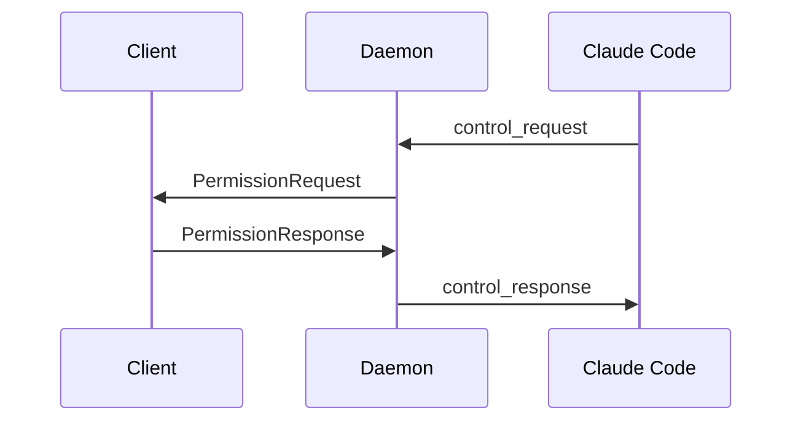
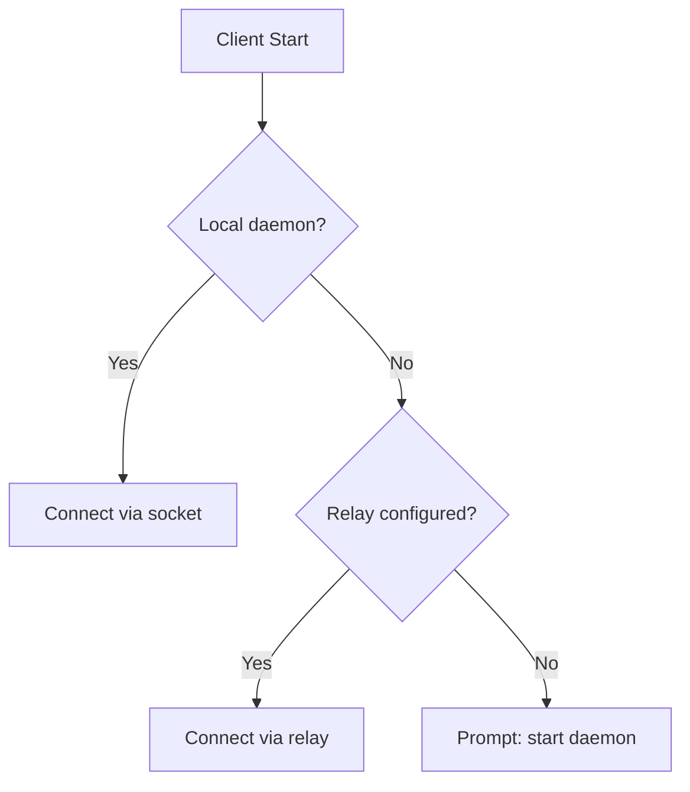

# ADR-005: Diagram Standard

**Status**: Accepted | **Date**: 2026-02-03

## Context

Architecture documentation contains diagrams in multiple formats: ASCII art, informal boxes-and-arrows, prose descriptions. This inconsistency makes documentation harder to maintain.

## Decision

**Standardize on Mermaid diagrams for all architecture documentation.**

### Comparison

| Criterion | Mermaid | ASCII | PlantUML | draw.io |
|-----------|---------|-------|----------|---------|
| Git-friendly | Yes | Yes | Yes | No |
| GitHub/GitLab render | Yes | Partial | No | No |
| Learning curve | Low | N/A | Medium | Low |
| Maintenance | Low | High | Medium | High |

### Migration Plan

1. New diagrams use Mermaid immediately
2. Existing ASCII converted incrementally
3. Priority: TOPOLOGY.md > OVERVIEW.md > DAEMON.md

### Example Usage

## Consequences

**Positive**: Consistent visual language; version-controlled source; automatic rendering in GitHub/GitLab; lower maintenance than ASCII.

**Negative**: Learning curve for unfamiliar contributors; some complex diagrams may not render well.

## Alternatives Considered

| Alternative | Rejected Because |
|-------------|------------------|
| Keep ASCII | High maintenance, inconsistent rendering |
| PlantUML | No native GitHub/GitLab rendering |
| draw.io | Binary files cause merge conflicts |
| D2 | Less ecosystem support |
