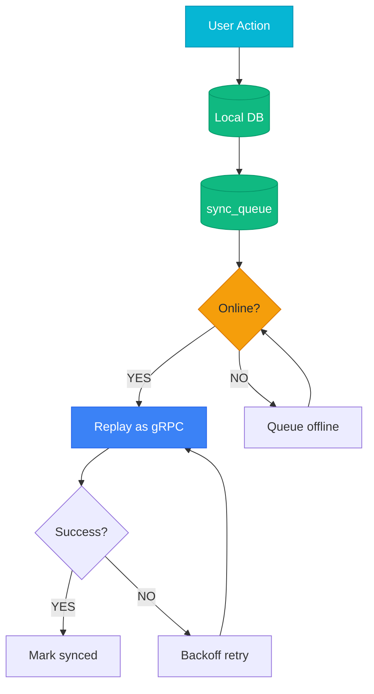
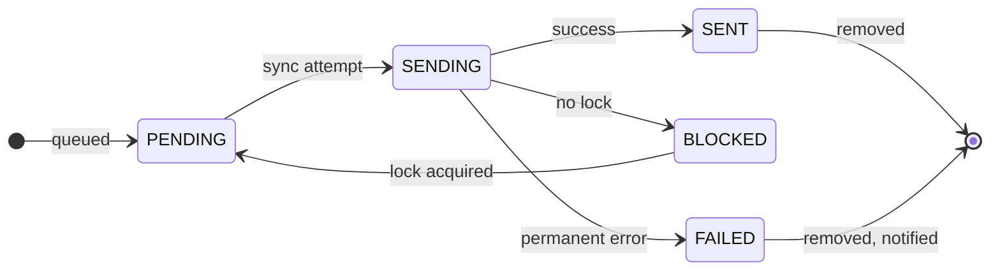
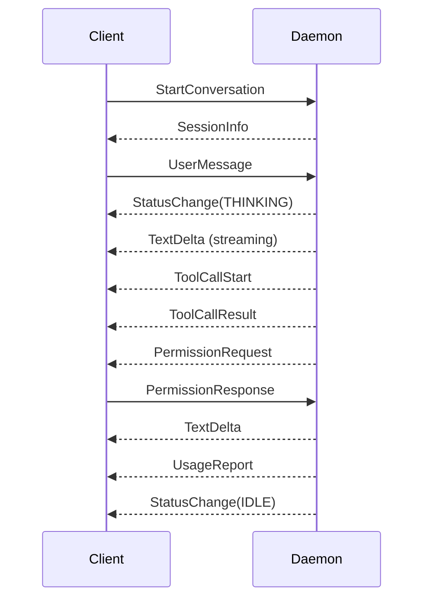
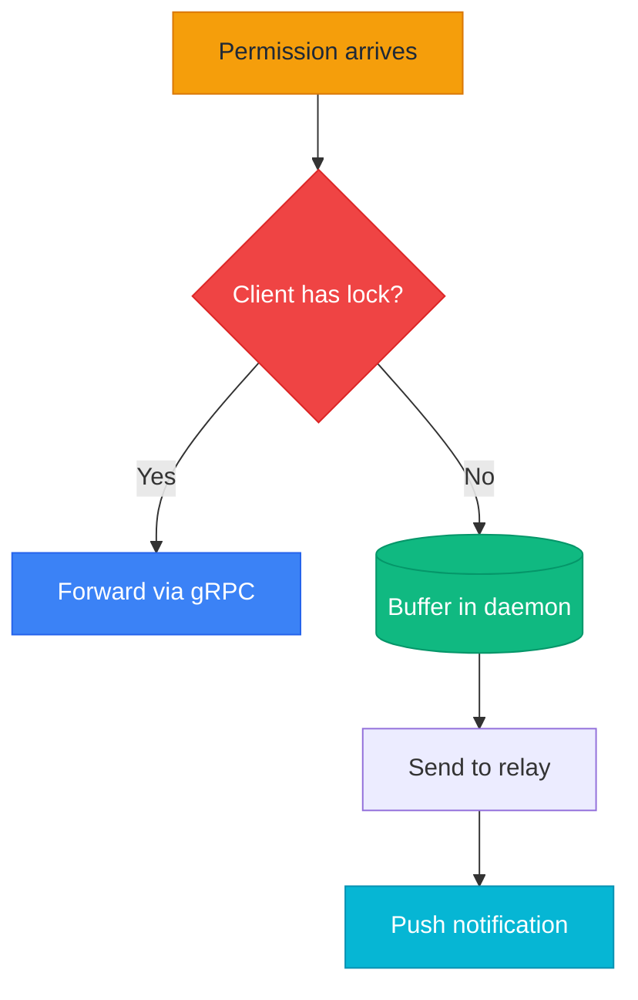

# Client Diagrams (Mermaid)

**Source**: CLIENTS.md
**Last Updated**: 2026-02-03

---

## 1. Sync Engine Flow

**Replaces**: ASCII flow at lines 224-233

**Description**: Offline sync queue processing.

---

## 2. Sync Queue State Machine

**Replaces**: ASCII state diagram at lines 354-362

---

## 3. gRPC Streaming Protocol

**Replaces**: ASCII sequence at lines 444-458

---

## 4. Push Notification Flow

**Replaces**: ASCII flow at lines 669-688

