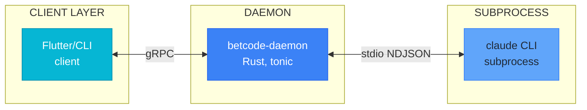
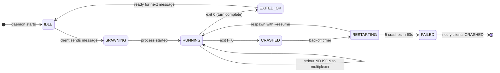
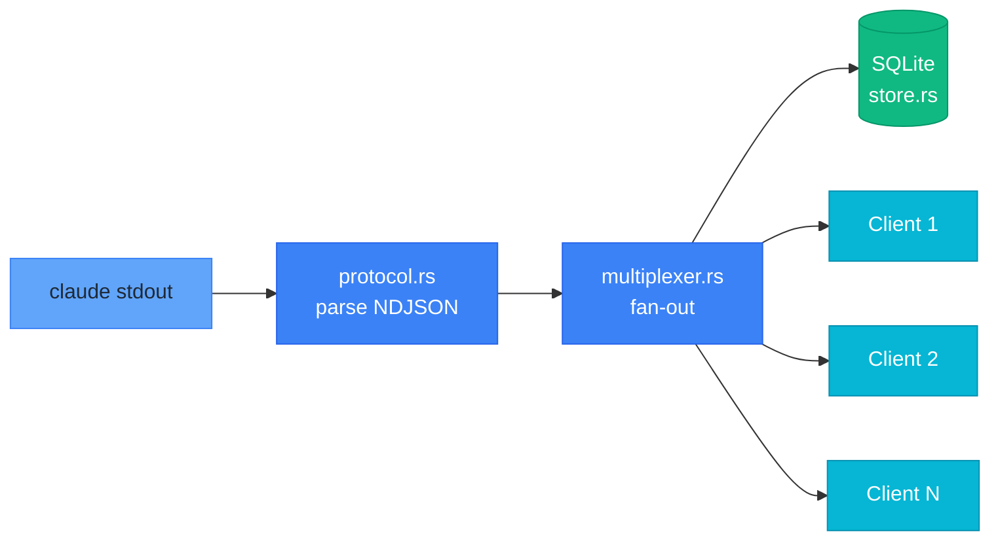
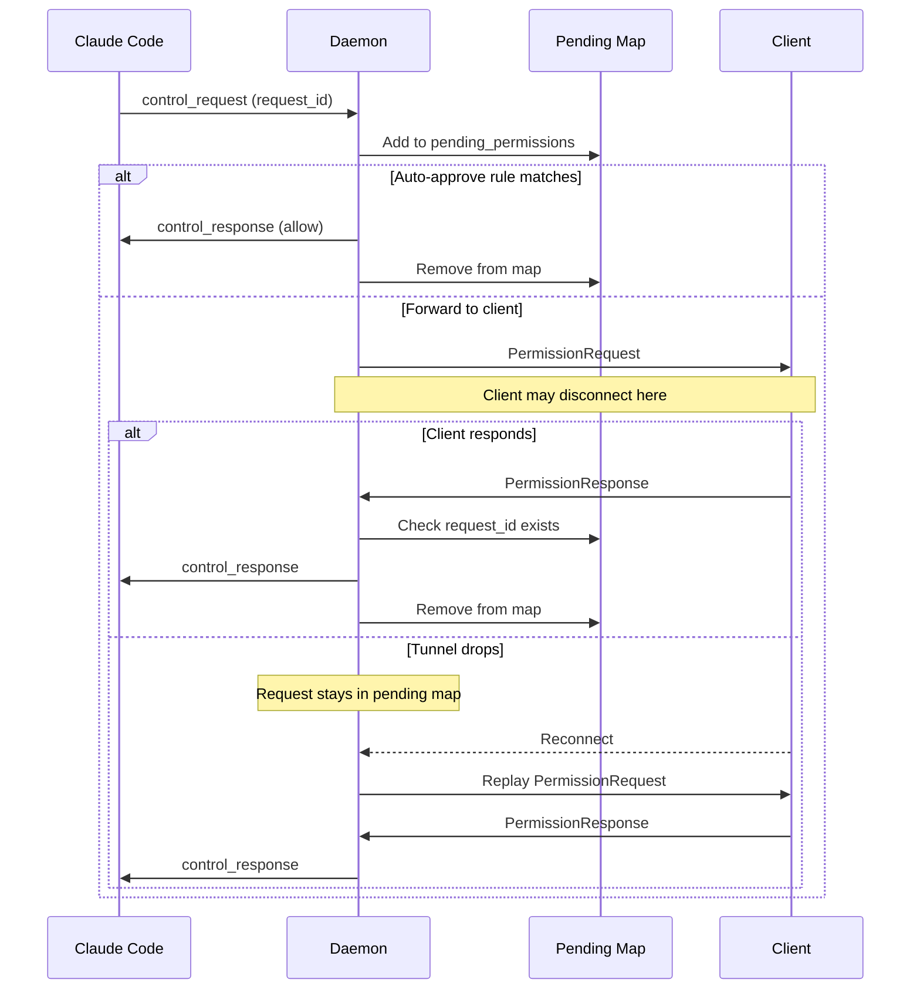

# Daemon Diagrams (Mermaid)

**Source**: DAEMON.md
**Last Updated**: 2026-02-14

---

## 1. Daemon Architecture

**Replaces**: ASCII diagram at line 18-27

**Description**: Three-tier architecture showing clients, daemon, and Claude subprocess.

---

## 2. Process Lifecycle State Diagram

**Replaces**: ASCII state diagram at line 88-99

**Description**: Claude subprocess lifecycle states.

---

## 3. Multiplexer Flow

**Replaces**: ASCII flow at line 171-176

**Description**: NDJSON parsing and broadcast to clients.

---

## 4. Permission Bridge Flow

**Replaces**: ASCII flow at line 231-266

**Description**: Permission request handling with reconnection replay.

