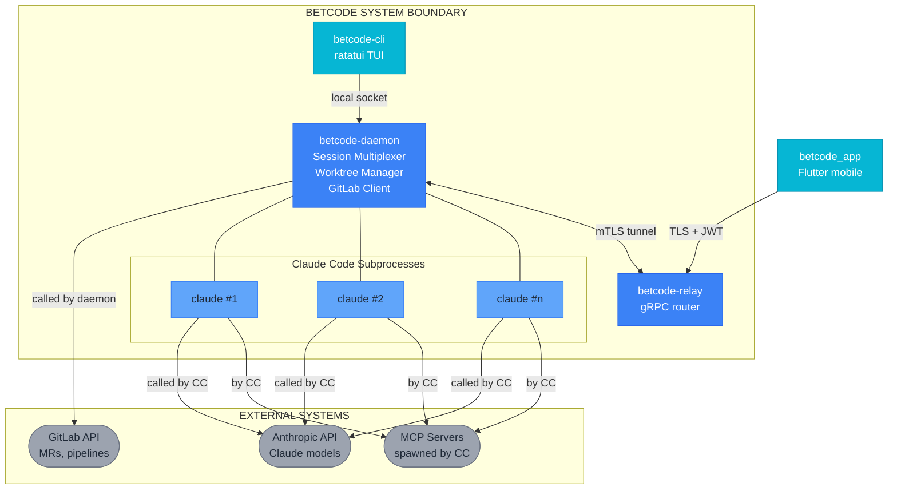
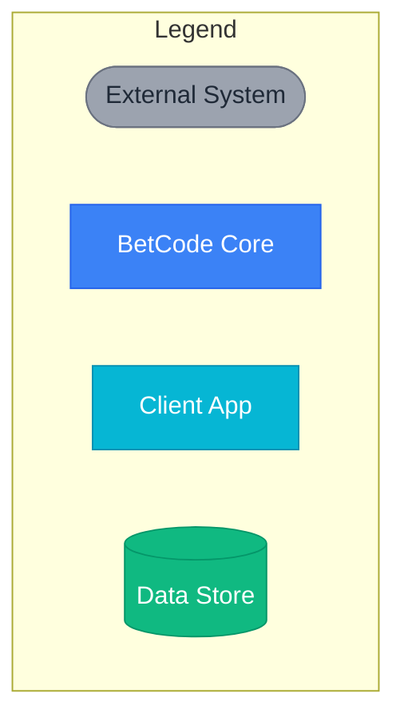

# Overview Diagrams (Mermaid)

**Source**: OVERVIEW.md
**Last Updated**: 2026-02-03

---

## C4 Context Diagram

**Replaces**: ASCII box diagram at line 34-62

**Description**: System context showing BetCode's relationship with external systems (Anthropic API, GitLab, MCP servers) and client applications.

---

## Legend

