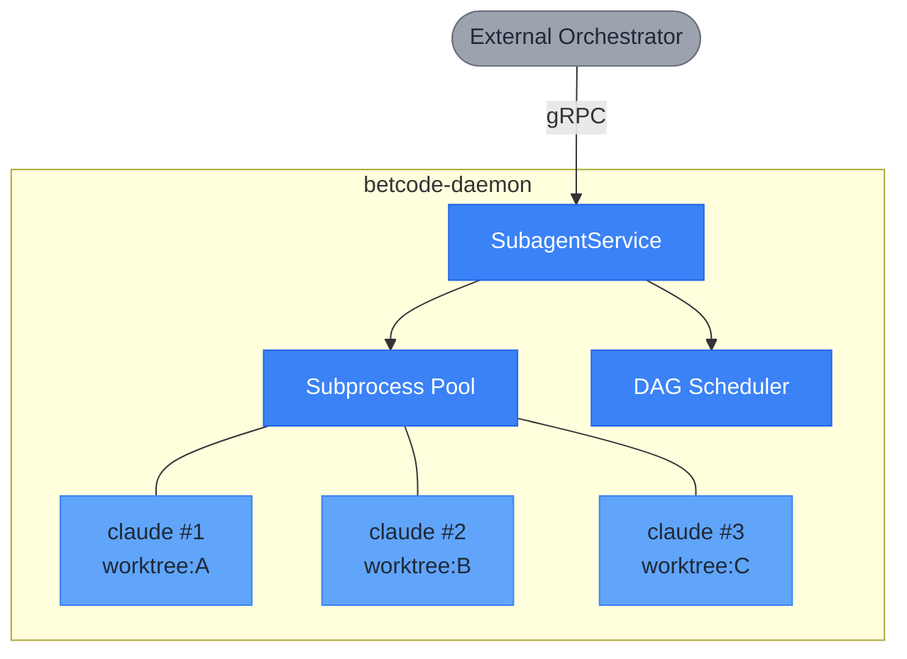
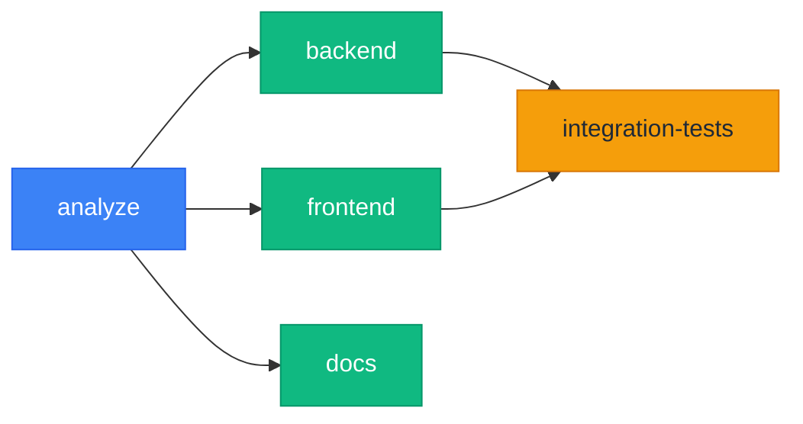
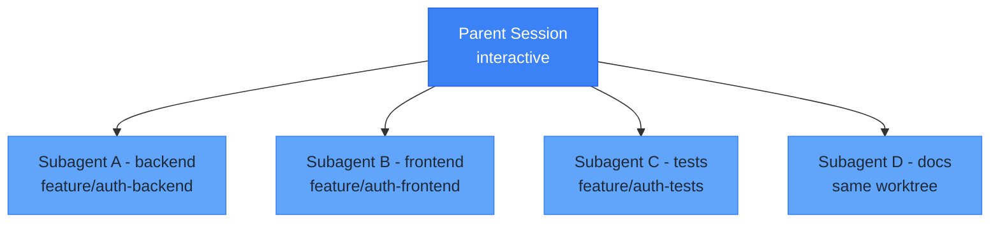

# Subagent Diagrams (Mermaid)

**Source**: SUBAGENTS.md
**Last Updated**: 2026-02-03

---

## 1. Orchestration Architecture

**Replaces**: ASCII diagram at lines 13-24

**Description**: External orchestrator connecting to daemon subprocess pool.

---

## 2. DAG Scheduler Example

**Replaces**: ASCII DAG at lines 200-209

**Description**: Task dependencies and parallel execution.

**Execution Timeline:**
- t0: spawn analyze
- t1: complete -> spawn backend, frontend, docs in parallel
- t2: backend + frontend complete -> spawn integration-tests
- t3: all complete

---

## 3. Session Hierarchy

**Replaces**: ASCII hierarchy at lines 411-419

