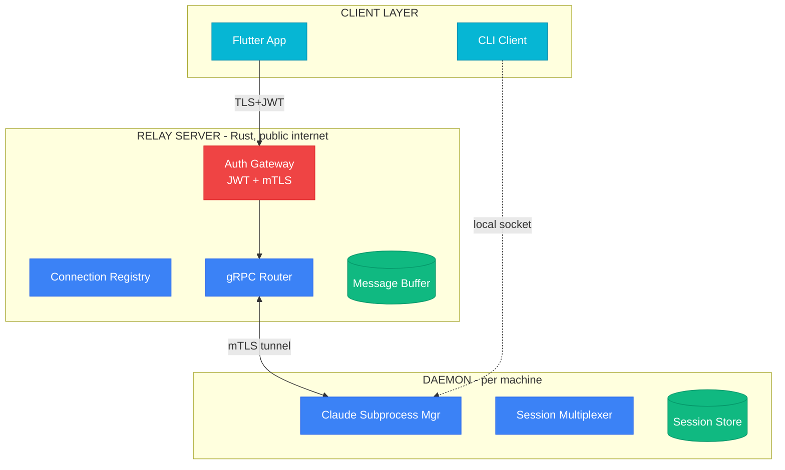
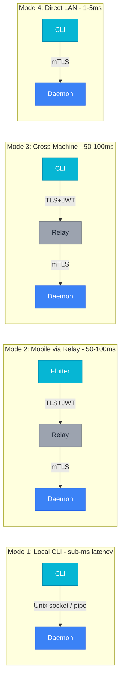
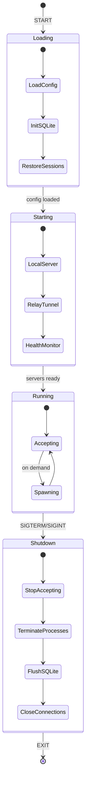

# Topology Diagrams (Mermaid)

**Source**: TOPOLOGY.md
**Last Updated**: 2026-02-14

---

## 1. High-Level Topology

**Replaces**: ASCII topology at line 26-50

**Description**: Star topology with relay at center.

---

## 2. Connection Modes

**Replaces**: ASCII diagrams at lines 66-97

**Description**: Four connection modes with different network paths.

---

## 3. Daemon Lifecycle

**Replaces**: ASCII diagram at lines 259-282

**Description**: Startup and shutdown sequences.

